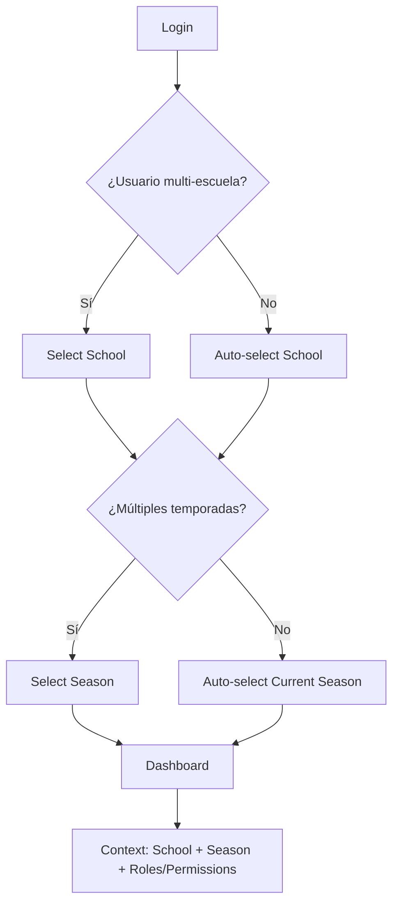

# 📋 Documentación Técnica Completa - Boukii V5

## 🏗️ Arquitectura del Sistema

### Componentes del Ecosistema
```
┌─────────────────────────────────────────────────────────────┐
│                    BOUKII ECOSYSTEM V5                     │
├─────────────────────────────────────────────────────────────┤
│ 1. Admin Panel (Angular 18)     - /front                   │
│ 2. Booking Page (Angular)        - Repositorio separado    │
│ 3. Monitor App (Ionic)           - iOS/Android             │
│ 4. API Backend (Laravel 10+)     - /api con scopes         │
└─────────────────────────────────────────────────────────────┘
```

### Flujo de Autenticación Multi-Escuela


---

## 📱 Panel de Administración - Especificaciones Detalladas

### 🎯 Layout Principal
```typescript
interface AppLayout {
  sidebar: {
    collapsible: boolean;
    sections: NavigationSection[];
    roleBasedVisibility: boolean;
  };
  header: {
    globalSearch: SearchComponent;
    themeToggle: ThemeToggleComponent;
    notifications: NotificationCenter;
    languageSelector: LanguageSelectorComponent;
    userMenu: UserMenuComponent;
  };
  main: {
    breadcrumbs: BreadcrumbComponent;
    pageContent: RouterOutlet;
  };
}
```

### 🏠 Dashboard
**Datos en tiempo real:**
- **Meteorología** (AccuWeather API integration)
- **Resumen del día**: Cursos programados, reservas activas
- **Estadísticas rápidas**: Ingresos diarios, ocupación, monitores activos
- **Alertas**: Reservas pendientes de validación, pagos pendientes
- **Timeline**: Próximos eventos del día

---

## 📅 Pantallas Principales - Especificaciones

### 1. 📅 PLANIFICADOR (Vista Calendar)
**Funcionalidad Core:**
```typescript
interface PlanificadorFeatures {
  vistas: ['dia', 'semana', 'mes'];
  filtros: {
    monitor: MultiSelectFilter;
    cliente: SearchFilter;
    disponibilidad: ['libres', 'ocupados', 'todos'];
    tipoEvento: ['reserva', 'curso', 'bloqueo'];
    deporte: MultiSelectFilter;
  };
  acciones: {
    dragAndDrop: {
      validacionRequiremientos: boolean;
      warningModal: boolean;
    };
    crearBloqueo: BloqueoModal;
    crearReserva: ReservaQuickModal;
    editarEvento: EventoDetailModal;
  };
}
```

**Estados de Eventos:**
- 🟢 **Confirmado**: Verde
- 🟡 **Pendiente validación**: Amarillo  
- 🔴 **Cancelado**: Rojo
- 🔵 **Bloqueo**: Azul
- ⚫ **Indisponibilidad**: Gris

### 2. 📋 RESERVAS
**Estructura de datos:**
```typescript
interface ReservaDetailed {
  id: number;
  cliente: ClienteDetail;
  participantes: Utilizador[];
  curso: CursoDetail;
  monitor: MonitorDetail;
  fechas: FechaSession[];
  extras: ExtraItem[];
  estado: 'activa' | 'finalizada' | 'anulada' | 'pendiente_pago';
  pagos: PagoDetail[];
  observaciones: string;
  evaluaciones: EvaluacionMonitor[];
}
```

**Operaciones CRUD:**
- ✅ **Crear**: Wizard multi-step (Cliente → Participantes → Curso → Detalles → Extras → Confirmación)
- ✅ **Editar**: Modal complejo con tabs (Datos, Pagos, Participantes, Observaciones)
- ✅ **Cancelar**: Parcial o total con política de reembolso
- ✅ **Transferir**: Cambio de grupo/monitor con validaciones

### 3. 🎓 CURSOS  
**Tipos de Curso:**
```typescript
enum TipoCurso {
  INDIVIDUAL = 'individual',
  COLECTIVO = 'colectivo', 
  FLEXIBLE = 'flexible',
  INTENSIVO = 'intensivo'
}

interface CursoCreation {
  deporte: DeporteConfig;
  configuracion: {
    tipo: TipoCurso;
    niveles: NivelConfig[];
    grupos: GrupoConfig[];
    fechas: FechaConfig;
    extras: ExtraConfig[];
  };
  traducciones: {
    autoTranslate: boolean; // DeepL API
    idiomas: Language[];
  };
  integraciones: {
    microgate?: MicrogateConfig; // Para marcas/tiempos
  };
}
```

### 4. 🎫 BONOS Y CÓDIGOS (Rediseño completo)
**Tipos expandidos:**
```typescript
interface BonoSystem {
  tipos: {
    compra: BonoCompra;     // Bonos tradicionales de horas/clases
    regalo: BonoRegalo;     // Tarjetas regalo con código
    cupon: CuponDescuento;  // Descuentos promocionales
    fidelidad: BonoFidelidad; // Sistema de puntos
  };
  configuracion: {
    validez: DateRange;
    restricciones: RestrictionRule[];
    transferible: boolean;
    acumulable: boolean;
  };
}
```

### 5. 📧 COMUNICACIONES
**Sistema de mensajería:**
```typescript
interface CommunicationCenter {
  emailMasivo: {
    segmentacion: ClienteSegment[];
    plantillas: EmailTemplate[];
    programacion: ScheduleConfig;
    tracking: EmailAnalytics;
  };
  notificaciones: {
    push: PushNotification[];
    sms: SMSCampaign[];
    inApp: InAppNotification[];
  };
  integraciones: {
    whatsappBusiness?: WhatsAppConfig;
  };
}
```

### 6. 💬 CHAT (Nuevo)
**Opciones de implementación:**
1. **Chat interno** con Socket.io
2. **WhatsApp Business API** integration
3. **Híbrido**: Interno + WhatsApp para clientes externos

### 7. 📊 ESTADÍSTICAS (Rediseño completo)
**Métricas clave:**
```typescript
interface AnalyticsDashboard {
  financiero: {
    ingresosTotales: RevenueMetrics;
    metodoPago: PaymentMethodStats;
    trending: RevenueTrend;
    proyecciones: ForecastData;
  };
  operativo: {
    ocupacionMonitores: OccupancyRate;
    cursosMasPopulares: CoursePopularity;
    clientesFrecuentes: ClientFrequency;
    cancelaciones: CancellationRate;
  };
  temporal: {
    horasMonitores: InstructorHours;
    salarios: PayrollCalculation;
    estacionalidad: SeasonalTrends;
  };
}
```

### 8. 👨‍🏫 MONITORES
**Gestión avanzada:**
```typescript
interface MonitorManagement {
  datosPersonales: PersonalData;
  competencias: {
    deportes: DeporteLevel[];
    certificaciones: Certification[];
    idiomas: LanguageLevel[];
  };
  salarios: {
    porTemporada: SeasonSalary[];
    porDeporte: SportRate[];
    porBloqueo: BlockageRate[];
    bonificaciones: BonusStructure;
  };
  disponibilidad: AvailabilityCalendar;
  evaluaciones: PerformanceReview[];
}
```

### 9. 👥 CLIENTES (Ya implementado + mejoras)
**Funcionalidades expandidas:**
```typescript
interface ClienteProfile {
  // Ya implementado en nuestra versión
  datosBasicos: ClientData;
  utilizadores: UtilizadorList;
  deportes: ClientSportProgress;
  observaciones: ObservationHistory;
  historial: BookingHistory;
  
  // Nuevas funcionalidades
  progreso: {
    evaluaciones: EvaluacionMonitor[];
    objetivos: ObjetivoPersonal[];
    logros: Achievement[];
  };
  comunicacion: {
    preferencias: CommunicationPrefs;
    historialMensajes: MessageHistory;
  };
}
```

### 10. 🔧 AJUSTES (Reorganización por módulos)
**Estructura modular:**
```typescript
interface SettingsModules {
  general: {
    temporadas: SeasonManagement;
    idiomas: LanguageConfig;
    moneda: CurrencyConfig;
  };
  deportes: {
    deportesPermitidos: SportConfiguration;
    niveles: LevelManagement;
    equipamiento: EquipmentCatalog; // Nuevo para renting
  };
  cursos: {
    tiposCurso: CourseTypeConfig;
    tablasPrecios: PricingTables;
    politicasCancelacion: CancellationPolicies;
  };
  comunicacion: {
    plantillasEmail: EmailTemplates;
    configuracionSMS: SMSConfig;
    notificaciones: NotificationSettings;
  };
  pagos: {
    metodosPermitidos: PaymentMethods;
    iva: TaxConfiguration;
    reembolsos: RefundPolicies;
  };
}
```

---

## 🆕 Módulo de Renting de Material

### Especificación completa:
```typescript
interface RentingModule {
  catalogo: {
    categorias: EquipmentCategory[];
    productos: EquipmentItem[];
    variantes: ItemVariant[]; // Tallas, colores, etc.
    stock: StockManagement;
  };
  reservas: {
    standalone: EquipmentBooking;
    integradaConCurso: CourseEquipmentAdd;
    politicas: RentalPolicies;
  };
  gestion: {
    inventario: InventoryTracking;
    mantenimiento: MaintenanceSchedule;
    depositos: SecurityDepositManagement;
    danos: DamageAssessment;
  };
}
```

---

# 🚀 Plan de Implementación - Prompts Detallados

## FASE 1: FUNDACIONES (Semanas 1-2)

### Prompt 1.1: Arquitectura Base y Migración
```markdown
**Tarea**: Configurar arquitectura base V5 y sistema de migración

**Contexto**: Tenemos legacy en `/front-legacy` y V5 en `/front`. Necesitamos coexistencia temporal.

**Requisitos específicos**:
1. **Configurar build dual**: 
   - Mantener legacy funcional en subdirectorio `/legacy`
   - V5 como aplicación principal en `/`
   - Nginx routing para ambas versiones

2. **Sistema de feature flags**:
   - Servicio `FeatureFlagService` con configuración por escuela
   - Flags para migración gradual: `useV5Dashboard`, `useV5Planificador`, etc.
   - Almacenamiento en Redis con TTL configurable

3. **Migración de datos**:
   - Scripts SQL para migrar datos legacy a nuevas tablas V5
   - Preservar IDs para mantener relaciones
   - Backup automático antes de cada migración

4. **Logging y monitoreo**:
   - Sistema de logs detallado para debugging migración
   - Métricas de performance comparativas V4 vs V5
   - Alertas automáticas para errores críticos

**Entregables**:
- Dockerfile configurado para build dual
- FeatureFlagService implementado
- Scripts de migración SQL
- Dashboard de monitoreo básico
```

### Prompt 1.2: Autenticación y Context Management
```markdown
**Tarea**: Implementar sistema de autenticación multi-escuela/temporada V5

**Contexto**: Los usuarios pueden tener acceso a múltiples escuelas con diferentes roles por temporada.

**Requisitos específicos**:
1. **AuthV5Service**:
   - Login con selección de escuela si múltiples disponibles
   - Gestión de contexto escuela/temporada en LocalStorage con TTL
   - Refresh automático de permisos cada 30 minutos
   - Logout automático por inactividad configurable

2. **Guards mejorados**:
   - `MultiSchoolGuard`: Maneja selección de escuela
   - `SeasonGuard`: Valida acceso a temporada específica
   - `PermissionGuard`: Valida permisos granulares por ruta
   - `TemporadaCerradaGuard`: Solo superadmin/admin en temporadas cerradas

3. **ContextService**:
   - Estado reactivo con signals para escuela/temporada actual
   - Cache de permisos por contexto
   - Interceptor para headers automáticos (X-School-ID, X-Season-ID)

4. **UI Components**:
   - `SchoolSelectorComponent` con búsqueda y favoritos
   - `SeasonSelectorComponent` con indicadores de estado
   - `UserMenuComponent` con cambio rápido de contexto

**Entregables**:
- AuthV5Service completo con tests
- Guards implementados y configurados
- Componentes de selección UI/UX
- Documentación de flujos de autenticación
```

### Prompt 1.3: Theming y Responsive Framework
```markdown
**Tarea**: Sistema de theming avanzado y framework responsive

**Contexto**: Panel debe soportar tema claro/oscuro, ser completamente responsive y mantener consistencia visual.

**Requisitos específicos**:
1. **Design System**:
   - Tokens CSS variables en `/styles/tokens/`
   - Paleta de colores completa (primary, secondary, semantic)
   - Tipografía con escalas responsivas
   - Spacing system consistente (4px base)

2. **Theme Service**:
   - `ThemeService` con persistencia en localStorage
   - Transiciones suaves entre temas
   - Soporte para tema automático (system preference)
   - Preload de assets por tema para evitar flickers

3. **Component Library**:
   - Atomic Design: atoms, molecules, organisms
   - Componentes base: Button, Input, Modal, Table, Card
   - Cada componente con variantes de tema
   - Storybook configurado para testing visual

4. **Responsive Strategy**:
   - Mobile-first approach
   - Breakpoints: 480px, 768px, 1024px, 1440px
   - Grid system flexible
   - Touch-friendly en dispositivos móviles

**Entregables**:
- Design tokens CSS completos
- Component library básica
- ThemeService implementado
- Storybook configurado con casos de uso
```

## FASE 2: CORE FEATURES (Semanas 3-6)

### Prompt 2.1: Dashboard y Layout Principal
```markdown
**Tarea**: Implementar dashboard principal y layout de la aplicación

**Contexto**: El dashboard es la landing page después del login, debe mostrar información relevante del día y permitir navegación rápida.

**Requisitos específicos**:
1. **Layout Architecture**:
   - Sidebar collapsible con animaciones suaves
   - Header fijo con search global, notificaciones, theme toggle
   - Breadcrumbs automáticos basados en rutas
   - Loading states para todas las transiciones

2. **Dashboard Widgets**:
   - **WeatherWidget**: Integración AccuWeather API con ciudad de la escuela
   - **TodayScheduleWidget**: Cursos y reservas del día con timeline
   - **QuickStatsWidget**: Cards con métricas rápidas (ingresos, ocupación)
   - **AlertsWidget**: Notificaciones importantes (pagos pendientes, validaciones)
   - **RecentActivityWidget**: Últimas acciones del usuario

3. **Global Search**:
   - Search universal en header con Cmd/Ctrl+K
   - Búsqueda en clientes, monitores, reservas, cursos
   - Resultados agrupados por tipo con preview
   - Navegación directa desde resultados

4. **Notification Center**:
   - Sistema de notificaciones en tiempo real
   - Tipos: nueva_reserva, pago_recibido, cancelacion, sistema
   - Badge counter en header
   - Historial persistente con paginación

**Entregables**:
- Layout principal responsive completo
- Dashboard con widgets funcionales
- Global search operativo
- Sistema de notificaciones básico
```

### Prompt 2.2: Planificador (Vista Calendar)
```markdown
**Tarea**: Implementar el planificador como vista de calendario avanzada

**Contexto**: Es la herramienta principal para gestionar reservas, cursos y disponibilidad de monitores. Debe ser intuitiva y potente.

**Requisitos específicos**:
1. **Calendar Engine**:
   - Vistas: día (slots 30min), semana (7 días), mes (overview)
   - Navegación rápida con date picker
   - Timezone handling automático por escuela
   - Performance optimizada para 100+ eventos simultáneos

2. **Event Management**:
   - Drag & drop con validaciones en tiempo real
   - Resize de eventos para cambiar duración
   - Color coding por tipo: reserva, curso, bloqueo, indisponibilidad
   - Estados visuales: confirmado, pendiente, cancelado

3. **Smart Filtering**:
   - Multi-select monitores con search
   - Filtro por disponibilidad: libres/ocupados/todos
   - Filtro por deporte con iconos
   - Filtro por cliente con autocomplete
   - Filtros persistentes en sessionStorage

4. **Quick Actions**:
   - Doble click para crear evento rápido
   - Context menu en click derecho
   - Modal de vista rápida en hover
   - Shortcuts de teclado para navegación

5. **Validación Inteligente**:
   - Check de requisitos monitor: nivel, idioma, disponibilidad
   - Warning modal con opción "bajo mi responsabilidad"
   - Conflictos automáticos con sugerencias alternativas

**Entregables**:
- Componente Calendar completo y optimizado
- Sistema de filtros avanzado
- Drag & drop con validaciones
- Modal de quick actions
```

### Prompt 2.3: Gestión de Monitores
```markdown
**Tarea**: Sistema completo de gestión de monitores con perfiles avanzados

**Contexto**: Los monitores son el core del negocio. Necesitan perfiles detallados, gestión de salarios, competencias y disponibilidad.

**Requisitos específicos**:
1. **Profile Management**:
   - Wizard de creación con steps: datos personales → competencias → salarios → disponibilidad
   - Upload de documentos: certificaciones, contratos, fotos
   - Timeline de historial profesional
   - Sistema de tags para categorización rápida

2. **Competencias y Certificaciones**:
   - Matriz deporte × nivel con validaciones
   - Upload y gestión de certificaciones con fechas de vencimiento
   - Sistema de idiomas con niveles (A1-C2)
   - Skills adicionales: primeros auxilios, experiencia grupos, etc.

3. **Salary Management por Temporada**:
   - Estructura salarial configurable por deporte
   - Rates diferentes: clase individual, grupal, bloqueo
   - Sistema de bonificaciones por performance/antigüedad
   - Calculadora automática de nóminas

4. **Availability Calendar**:
   - Calendario personal de disponibilidad
   - Bloqueos recurrentes (vacaciones, otros trabajos)
   - Preferencias de horarios
   - Integración con planificador principal

5. **Performance Tracking**:
   - Evaluaciones de clientes automáticas
   - Métricas: puntualidad, satisfacción, ventas adicionales
   - Goals y objetivos por temporada
   - Sistema de reconocimientos/badges

**Entregables**:
- CRUD completo de monitores con wizard
- Sistema de competencias y certificaciones
- Gestión salarial por temporada
- Calendar de disponibilidad personal
- Dashboard de performance básico
```

## FASE 3: RESERVAS Y CURSOS (Semanas 7-10)

### Prompt 3.1: Sistema de Reservas Rediseñado
```markdown
**Tarea**: Rediseñar completamente el sistema de reservas con UX/UI moderna

**Contexto**: Las reservas son críticas y actualmente tienen una interfaz problemática. Necesita ser intuitiva, rápida y sin errores.

**Requisitos específicos**:
1. **Reserva Creation Wizard**:
   - **Step 1**: Cliente selection con search y quick-add
   - **Step 2**: Participantes selection (cliente + utilizadores)
   - **Step 3**: Deporte y curso selection con filtros inteligentes
   - **Step 4**: Fechas y horarios con calendar picker
   - **Step 5**: Extras y servicios adicionales
   - **Step 6**: Resumen y confirmación con pricing breakdown

2. **Advanced Search & Filters**:
   - Full-text search en cliente, curso, monitor
   - Tabs de estado: activas, finalizadas, canceladas, todas
   - Filtros laterales: fecha, deporte, tipo, estado pago
   - Bulk actions: cancelar múltiples, export, email masivo

3. **Reservation Detail View**:
   - Layout tabs: Información General, Participantes, Pagos, Historial
   - Timeline de cambios y acciones
   - Quick actions: cancelar, transferir, añadir participante
   - Integration con billing para pagos y reembolsos

4. **Smart Validation Engine**:
   - Validación de disponibilidad en tiempo real
   - Check de requisitos automático (nivel, edad, etc.)
   - Sugerencias alternativas en conflictos
   - Preview de pricing antes de confirmar

5. **Cancellation & Refund System**:
   - Políticas de cancelación configurables
   - Cálculo automático de reembolsos
   - Partial cancellations (algunas fechas)
   - Integration con payment gateway para refunds

**Entregables**:
- Wizard de creación step-by-step
- Lista avanzada con filtros y search
- Modal de detalle completo
- Sistema de cancelaciones y reembolsos
```

### Prompt 3.2: Sistema de Cursos Avanzado
```markdown
**Tarea**: Rediseñar el sistema de cursos como "joya de la corona" de la aplicación

**Contexto**: Los cursos son productos complejos con múltiples configuraciones. La interfaz debe ser profesional y manejar toda la complejidad sin confundir al usuario.

**Requisitos específicos**:
1. **Course Creation Wizard Avanzado**:
   - **Step 1**: Tipo de curso con preview de configuraciones
   - **Step 2**: Deporte y configuración base (duración, intensidad)
   - **Step 3**: Fechas inteligentes con patterns (ej: "Lunes y Miércoles por 4 semanas")
   - **Step 4**: Grupos y niveles con capacity management
   - **Step 5**: Pricing strategy con tablas dinámicas
   - **Step 6**: Extras y servicios adicionales
   - **Step 7**: Marketing (descripción, imágenes, traducciones)

2. **Flexible Course Types**:
   - **Individual**: 1-on-1 con monitor asignado
   - **Colectivo**: Grupos fijos con niveles
   - **Flexible**: Self-paced con credits system
   - **Intensivo**: Short-term con multiple sessions/day

3. **Group Management (Cursos Colectivos)**:
   - Auto-assign por nivel con manual override
   - Transfer entre grupos con approval workflow
   - Capacity alerts y waiting lists
   - Performance tracking por grupo

4. **Advanced Pricing Engine**:
   - Pricing tables por duración × participantes
   - Early bird discounts con fechas
   - Family discounts automáticos
   - Seasonal pricing adjustments

5. **Microgate Integration** (Para escuelas con timing):
   - API connection para import de marcas/tiempos
   - Leaderboards automáticos
   - Performance analytics por participante
   - Export de datos para competiciones

6. **Multi-language Support**:
   - DeepL API integration para auto-traducción
   - Manual override para traducciones custom
   - Preview por idioma antes de publicar

**Entregables**:
- Course creation wizard profesional
- Group management system
- Pricing engine flexible
- Microgate integration básica
- Sistema de traducciones automáticas
```

### Prompt 3.3: Módulo de Renting de Material
```markdown
**Tarea**: Crear módulo completo de renting de material deportivo

**Contexto**: Funcionalidad nueva que debe integrarse perfectamente con reservas y cursos, generando revenue adicional.

**Requisitos específicos**:
1. **Equipment Catalog Management**:
   - Categorías jerárquicas (Deportes → Equipos → Variantes)
   - Producto con múltiples variantes (tallas, colores)
   - Image gallery con zoom
   - Specifications técnicas detalladas
   - QR codes para inventory tracking

2. **Inventory & Stock Management**:
   - Real-time stock tracking
   - Low stock alerts automáticas
   - Maintenance scheduling con estados
   - Damage assessment workflow
   - Replacement cost tracking

3. **Rental Booking System**:
   - **Standalone rentals**: Solo alquiler de material
   - **Integrated rentals**: Añadir a reservas/cursos existentes
   - Calendar de disponibilidad por item
   - Bulk booking para grupos

4. **Pricing & Policies**:
   - Flexible pricing: por hora, día, semana, mes
   - Security deposits configurables
   - Late return penalties automáticas
   - Damage charges con approval workflow

5. **Integration Points**:
   - Add equipment en course/reservation wizard
   - Automatic recommendations basadas en deporte
   - Checkout integrado con payment system
   - Return process con QR scanning

6. **Analytics & Reporting**:
   - Revenue por categoría de equipment
   - Utilization rates por item
   - Popular equipment ranking
   - Damage/loss reports

**Entregables**:
- Catalog management completo
- Inventory tracking system
- Rental booking workflow
- Integration con reservas/cursos
- Basic analytics dashboard
```

## FASE 4: FEATURES AVANZADAS (Semanas 11-14)

### Prompt 4.1: Sistema de Comunicaciones Unificado
```markdown
**Tarea**: Crear centro de comunicaciones unificado con múltiples canales

**Contextos**: Las escuelas necesitan comunicarse efectivamente con clientes y monitores por varios canales.

**Requisitos específicos**:
1. **Email Marketing System**:
   - Segmentación avanzada: por deporte, nivel, última actividad
   - Drag & drop email builder con templates
   - A/B testing para subject lines
   - Scheduling con timezone optimization
   - Analytics: open rate, click rate, conversions

2. **SMS/WhatsApp Integration**:
   - SMS para notificaciones críticas (confirmaciones, recordatorios)
   - WhatsApp Business API para soporte
   - Template messages pre-aprovados
   - Bulk messaging con opt-out compliance

3. **In-App Notifications**:
   - Real-time notifications con WebSockets
   - Categorización: reservas, pagos, sistema, marketing
   - User preferences para cada tipo
   - Push notifications para mobile users

4. **Communication Center Dashboard**:
   - Inbox unificado: emails, SMS, WhatsApp, chats
   - Quick responses y templates
   - Assignment a team members
   - SLA tracking para response times

5. **Automation Workflows**:
   - Trigger-based messaging: nueva reserva, cancelación, cumpleaños
   - Drip campaigns para onboarding
   - Re-engagement campaigns para inactive users
   - Review request automation post-class

**Entregables**:
- Email marketing platform
- SMS/WhatsApp integration
- Notification center completo
- Automation workflows básicos
```

### Prompt 4.2: Analytics y Reporting Avanzado
```markdown
**Tarea**: Sistema de analytics completo con dashboards ejecutivos

**Contexto**: Las escuelas necesitan insights profundos para tomar decisiones de negocio basadas en datos.

**Requisitos específicos**:
1. **Financial Analytics**:
   - Revenue tracking: diario, semanal, mensual, anual
   - Revenue breakdown: por deporte, monitor, tipo de curso
   - Payment method analysis con fees
   - Refund tracking y impact analysis
   - Forecasting basado en historical data

2. **Operational Analytics**:
   - Monitor utilization rates y productivity
   - Course popularity y profitability
   - Cancellation analysis con reasons
   - Peak hours identification
   - Capacity optimization suggestions

3. **Customer Analytics**:
   - Customer lifetime value calculation
   - Retention rates por cohorte
   - Churn prediction con early warnings
   - Satisfaction scoring basado en reviews
   - Segmentation automática para marketing

4. **Interactive Dashboards**:
   - Executive summary dashboard
   - Drill-down capabilities
   - Custom date ranges y comparisons
   - Export a PDF/Excel para reports
   - Scheduled email reports

5. **Real-time Monitoring**:
   - Live dashboard con key metrics
   - Alert system para anomalías
   - Performance notifications
   - System health monitoring

**Entregables**:
- Dashboard financiero completo
- Analytics operacionales
- Customer insights dashboard
- Real-time monitoring system
```

### Prompt 4.3: Bonos y Sistema de Fidelización
```markdown
**Tarea**: Rediseñar sistema de bonos y crear programa de fidelización

**Contexto**: Expandir más allá de bonos básicos hacia un sistema completo de loyalty y gift cards.

**Requisitos específicos**:
1. **Expanded Bonus Types**:
   - **Class Credits**: Traditional hour/class-based bonos
   - **Gift Cards**: Monetary value con expiration dates
   - **Promotional Coupons**: Percentage/fixed discounts
   - **Loyalty Points**: Earning y redemption system
   - **Referral Bonuses**: Friend referral rewards

2. **Advanced Configuration**:
   - Flexible expiration policies
   - Usage restrictions: specific courses, dates, monitors
   - Transferability rules entre users
   - Stacking policies para multiple bonuses
   - Auto-application logic

3. **Gift Card System**:
   - Custom denominations
   - Personalized messages
   - Email delivery con design templates
   - Physical card printing integration
   - Balance checking portal

4. **Loyalty Program**:
   - Points earning rules: per class, spend amount, referrals
   - Tier system con escalating benefits
   - Redemption catalog: classes, equipment, merchandise
   - Gamification elements: badges, streaks, challenges

5. **Marketing Integration**:
   - Promotional campaigns con automatic bonus creation
   - Birthday/anniversary bonuses
   - Win-back campaigns para inactive users
   - Seasonal promotions

**Entregables**:
- Sistema de bonos expandido
- Gift card platform
- Loyalty program completo
- Marketing automation integration
```

## FASE 5: ADMIN Y CONFIGURACIÓN (Semanas 15-16)

### Prompt 5.1: Gestión de Usuarios y Permisos Avanzada
```markdown
**Tarea**: Sistema completo de gestión de usuarios con RBAC granular

**Contexto**: Múltiples tipos de usuarios con permisos diferentes por escuela y temporada.

**Requisitos específicos**:
1. **Role-Based Access Control (RBAC)**:
   - Roles predefinidos: SuperAdmin, Admin, Manager, Monitor, Reception
   - Permisos granulares por módulo: read, write, delete, admin
   - Scope de permisos: global, por escuela, por temporada
   - Custom roles creation para casos específicos

2. **User Management Interface**:
   - Advanced search y filtering
   - Bulk operations: invite, deactivate, role assignment
   - User activity logging
   - Password policies enforcement

3. **Multi-School/Season Permissions**:
   - Matrix view: user × school × season × role
   - Quick assignment templates
   - Inheritance rules para simplified management
   - Audit trail para permission changes

4. **Invitation & Onboarding**:
   - Email invitations con custom messages
   - Self-registration con approval workflow
   - Onboarding checklist para new users
   - Training materials por role

**Entregables**:
- RBAC system completo
- User management interface
- Permission matrix management
- Invitation system
```

### Prompt 5.2: Sistema de Configuración Modular Completo
```markdown
**Tarea**: Implementar sistema completo de ajustes/configuraciones modular e intuitivo

**Contexto**: Los ajustes están actualmente dispersos en múltiples pantallas sin organización lógica. Necesita arquitectura modular clara con UX profesional que maneje toda la complejidad de configuración de una escuela deportiva.

**Requisitos específicos**:

1. **Settings Architecture Avanzada**:
   - **Navegación jerárquica**: Sidebar con módulos/submódulos expandibles
   - **Search global**: Autocompletado inteligente en todas las configuraciones
   - **Recent changes**: Timeline de cambios con diff viewer visual
   - **Import/Export**: Configuraciones completas (JSON/YAML) con validation
   - **Breadcrumbs dinámicos**: Navegación contextual con shortcuts
   - **Quick actions**: Atajos para configuraciones más comunes
   - **Favorites system**: Pin configuraciones frecuentemente usadas

2. **Module Organization Detallada**:

   **🏫 GENERAL**:
   - **Información Escuela**: Nombre, logo, dirección, múltiples contactos
   - **Temporadas/Períodos**: Configuración académica con fechas automáticas
   - **Idiomas**: Múltiples idiomas con fallbacks y contenido localizado
   - **Regional**: Moneda, timezone, formato fechas, días laborables
   - **Horarios Operación**: Horarios por día con excepciones y festivos
   - **Políticas Generales**: Términos, cancelación, reembolsos, privacidad

   **⚽ DEPORTES Y ACTIVIDADES**:
   - **Catálogo Deportes**: Gestión completa con imágenes, descripciones
   - **Niveles/Grados**: Sistema jerárquico por deporte (principiante → avanzado)
   - **Equipamiento**: Inventario requerido/recomendado por deporte y nivel
   - **Certificaciones**: Badges y certificados disponibles
   - **Evaluaciones**: Métricas y criterios de evaluación por deporte
   - **Progresión**: Pathways automáticos entre niveles

   **📚 CURSOS Y CLASES**:
   - **Tipos de Curso**: Plantillas (colectivo, privado, intensivo, camp)
   - **Pricing Tables**: Matrices dinámicas por duración/participantes/nivel
   - **Políticas Específicas**: Edad mín/máx, requisitos, cancelaciones
   - **Templates**: Plantillas pre-configuradas para creación rápida
   - **Grupos**: Configuración de capacidades y divisiones automáticas
   - **Extras**: Servicios adicionales (material, seguro, transporte)

   **📞 COMUNICACIONES**:
   - **Email Templates**: Biblioteca completa por tipo de evento
   - **SMS Configuration**: Providers, plantillas, triggers automáticos
   - **Push Notifications**: Configuración por app y tipo de usuario
   - **Automated Messaging**: Reglas y flujos de comunicación automática
   - **WhatsApp Business**: Templates, chatbots, flows conversacionales
   - **Marketing**: Newsletter, promociones, campaigns automáticas

   **💳 PAGOS Y FINANZAS**:
   - **Payment Methods**: Configuración por región/tipo de usuario
   - **Tax Configuration**: Rates, exenciones, reporting automático
   - **Refund Policies**: Reglas automáticas por tipo y timing
   - **Invoicing**: Templates, numeración, datos fiscales
   - **Gateway Management**: Múltiples providers con failover
   - **Financial Reporting**: Configuración de reports automáticos

   **👥 USUARIOS Y PERMISOS**:
   - **Roles System**: Matrix granular de permisos por módulo
   - **Invitation Templates**: Plantillas personalizables por rol
   - **Onboarding Flows**: Procesos guiados para nuevos usuarios
   - **Security Policies**: Passwords, 2FA, sesiones, lockout
   - **Access Control**: Restricciones por IP, horarios, ubicación
   - **Audit Configuration**: Logging detallado y retention policies

3. **Advanced Configuration Features**:
   - **Real-time Validation**: Validación inmediata con feedback visual
   - **Preview Mode**: Sandbox environment para testing de cambios
   - **Version Control**: Sistema completo de rollback con history
   - **Configuration Templates**: Templates para setup de nuevas escuelas
   - **Dependency Management**: Validación automática de dependencies
   - **Bulk Operations**: Operaciones masivas en configuraciones similares
   - **Smart Defaults**: Valores inteligentes basados en tipo de escuela

4. **Integration Settings Dashboard**:
   - **🌤️ AccuWeather**: API keys, location setup, weather alerts automation
   - **🌐 DeepL Translation**: API config, idiomas soportados, auto-translate rules
   - **⏱️ Microgate Integration**: Device pairing, timing sync, event config
   - **💰 Payment Gateways**: Configuración unificada múltiples providers
   - **📱 WhatsApp Business**: Account setup, verify, templates, automation
   - **📊 Analytics Platforms**: Google Analytics, Facebook Pixel, custom tracking
   - **📧 Email Services**: SendGrid, Mailgun, SMTP custom configuration
   - **💾 Storage Services**: AWS S3, Cloudinary para media management

5. **UX/UI Enhancements Profesionales**:
   - **Configuration Wizard**: Setup guiado paso-a-paso para nuevas escuelas
   - **Smart Search**: Búsqueda semántica con sugerencias inteligentes
   - **Visual Indicators**: Status badges (configured/pending/error/deprecated)
   - **Help System**: Tooltips contextuales, documentation links, video guides
   - **Bulk Selection**: Multi-select para operaciones masivas
   - **Keyboard Shortcuts**: Navegación rápida power-user friendly
   - **Mobile Responsive**: Configuraciones críticas accesibles desde móvil

6. **Audit & Compliance System**:
   - **Complete Change Log**: Audit trail detallado de todos los cambios
   - **User Attribution**: Tracking de quién cambió qué y cuándo
   - **Automatic Backups**: Snapshots antes de cambios importantes
   - **Compliance Validation**: GDPR, accessibility, security checks
   - **Export Capabilities**: Compliance reports, audit trails
   - **Rollback Mechanisms**: Restauración granular o completa

7. **School Template System**:
   - **Template Categories**: Por tipo de escuela (natación, tenis, multi-deporte)
   - **Regional Presets**: Configuraciones por país/región con localization
   - **Import/Export**: Transferir configuraciones entre escuelas
   - **Template Marketplace**: Compartir configuraciones entre organizaciones
   - **Version Management**: Templates versionados con changelog

**Entregables Detallados**:
- **Settings Architecture**: Sistema modular completo con 6 módulos principales
- **Configuration Management**: Sistema avanzado con version control y audit
- **Integration Dashboard**: Setup centralizado para 8+ servicios externos
- **Template System**: Onboarding automatizado para nuevas escuelas
- **Advanced UX**: Search, favorites, bulk operations, mobile support
- **Compliance System**: Audit completo y compliance automation
- **Documentation**: User guides, video tutorials, contextual help system
```

## FASE 6: TESTING Y DEPLOYMENT (Semanas 17-18)

### Prompt 6.1: Testing Strategy Completa
```markdown
**Tarea**: Implementar testing strategy completa para garantizar quality

**Contexto**: Sistema crítico que maneja pagos y bookings. Zero-downtime tolerance.

**Requisitos específicos**:
1. **Unit Testing**:
   - Coverage mínimo 80% para services y utils
   - Mock strategies para external APIs
   - Test data factories para consistent testing
   - Snapshot testing para components críticos

2. **Integration Testing**:
   - API integration tests con test database
   - Authentication flow testing
   - Payment gateway testing (sandbox)
   - Email/SMS delivery testing

3. **E2E Testing**:
   - Critical user journeys: login → create reservation → payment
   - Cross-browser testing: Chrome, Firefox, Safari
   - Mobile responsiveness testing
   - Performance testing bajo load

4. **Security Testing**:
   - OWASP vulnerability scanning
   - Authentication/authorization testing
   - Data encryption verification
   - GDPR compliance validation

**Entregables**:
- Test suite completa
- CI/CD pipeline con automated testing
- Security scanning integration
- Performance benchmarks
```

### Prompt 6.2: Deployment y Migración Strategy
```markdown
**Tarea**: Plan de deployment y migración de legacy a V5

**Contexto**: Migración gradual sin downtime para escuelas activas.

**Requisitos específicos**:
1. **Deployment Architecture**:
   - Blue-green deployment strategy
   - Database migration scripts con rollback
   - CDN setup para static assets
   - Monitoring y alerting comprehensive

2. **Migration Strategy**:
   - Feature flags para gradual rollout
   - Data validation scripts
   - User training materials
   - Support team preparation

3. **Rollback Plan**:
   - Automated rollback triggers
   - Data consistency checks
   - Communication plan para downtime
   - Post-mortem process

4. **Go-Live Checklist**:
   - Performance benchmarks validation
   - Security audit completion
   - User acceptance testing sign-off
   - Support documentation update

**Entregables**:
- Deployment automation scripts
- Migration playbook
- Rollback procedures
- Go-live checklist completo
```

---

## 📊 Resumen Ejecutivo

### Cronograma General:
- **Semanas 1-2**: Fundaciones (Auth, Theming, Arquitectura)
- **Semanas 3-6**: Core Features (Dashboard, Planificador, Monitores)  
- **Semanas 7-10**: Reservas, Cursos y Renting (Joyas de la corona)
- **Semanas 11-14**: Features Avanzadas (Comunicaciones, Analytics, Loyalty)
- **Semanas 15-16**: Admin y Configuración
- **Semanas 17-18**: Testing y Deployment

### Priorización por Criticidad:
1. 🔴 **Crítico**: Auth, Planificador, Reservas, Cursos
2. 🟡 **Alto**: Dashboard, Monitores, Clientes, Pagos
3. 🟢 **Medio**: Comunicaciones, Analytics, Renting
4. 🔵 **Bajo**: Bonos avanzados, Chat, Integraciones

### Métricas de Éxito:
- **Performance**: < 2s load time, > 95% uptime
- **UX**: < 3 clicks para acciones principales
- **Adoption**: 80% de escuelas migradas en 6 meses
- **Quality**: 0 bugs críticos en production

### Consideraciones Adicionales:

#### Ecosistema Completo:
- **Booking Page (Angular)**: Repositorio separado con routing por slug de escuela
- **Monitor App (Ionic)**: iOS/Android para monitores (planificador, asistencias, chat, evaluaciones)
- **API Backend (Laravel)**: Scopes separados (admin, bookingpage, app)

#### Mejoras de Arquitectura:
- **Booking Page**: Considerar subdomain approach vs slug routing
- **API Scopes**: Reorganizar para mejor separation of concerns
- **Shared Components**: Crear biblioteca compartida entre aplicaciones

#### Integraciones Críticas:
- **AccuWeather**: Meteorología en tiempo real
- **DeepL**: Traducciones automáticas
- **Microgate**: Timing y marcas deportivas
- **WhatsApp Business**: Comunicación con clientes
- **Payment Gateways**: Stripe, PayPal, etc.

#### Migración y Coexistencia:
- **Feature Flags**: Migración gradual por escuela
- **Data Migration**: Scripts automáticos con rollback
- **Training**: Materials para usuarios finales
- **Support**: Documentación y troubleshooting guides

---

## 📋 Estado de Implementación

### ✅ **PROMPT 1.1 COMPLETADO** - Arquitectura Base y Migración

**Fecha de Finalización**: 22 Enero 2025

#### Entregables Implementados:

1. **✅ Dockerfile configurado para build dual**
   - `docker/Dockerfile.frontend` - Multi-stage build V5 + Legacy
   - `docker/nginx.conf` - Configuración producción optimizada 
   - `docker/frontend.conf` - Routing inteligente con feature flags
   - `docker/feature-flag-check.js` - Detección client-side automática

2. **✅ FeatureFlagService implementado**
   - `front/src/app/core/services/feature-flag.service.ts` - Service Angular con signals
   - `front/src/app/core/guards/feature-flag.guard.ts` - Guards para routing condicional
   - `app/Services/FeatureFlagService.php` - Lógica de negocio Laravel
   - `app/Http/Controllers/V5/FeatureFlagController.php` - API completa CRUD
   - **20+ feature flags** configurables para rollout granular

3. **✅ Scripts de migración SQL**
   - `database/migrations/2025_01_01_000001_create_feature_flags_table.php` - Infraestructura
   - `database/migrations/2025_01_01_000002_migrate_legacy_data_to_v5.php` - Migración datos
   - `app/Console/Commands/V5MigrationCommand.php` - Comando Artisan con backup/rollback
   - Preservación completa de IDs y relaciones

4. **✅ Dashboard de monitoreo básico**
   - `front/src/app/features/v5-monitoring/components/monitoring-dashboard.component.ts` - Dashboard interactivo
   - `front/src/app/features/v5-monitoring/services/monitoring.service.ts` - Service métricas
   - `app/Http/Controllers/V5/MonitoringController.php` - API monitoring
   - `app/Services/V5MonitoringService.php` - Lógica alertas automáticas
   - `app/Models/PerformanceMetric.php` & `app/Models/V5MigrationLog.php` - Modelos datos

#### Arquitectura Implementada:

**🔄 Sistema Dual V4/V5**
- Nginx routing automático basado en feature flags activos por escuela
- Cache Redis optimizado (TTL 5min) para minimizar latencia
- Fallback automático a Legacy cuando V5 features deshabilitadas
- Script client-side para detección sin llamadas API adicionales

**📊 Monitoreo y Alerting**
- Comparativas V4 vs V5 en tiempo real con percentiles (P95, P99)
- Alertas automáticas Slack/Email por degradación performance (>5s)
- Sistema health checks (Database, Redis, Migration errors)
- Métricas performance con metadata (user-agent, contexto, etc.)

**🛡️ Migración Segura**
- Backups automáticos mysqldump antes de cualquier migración
- Rollback automático si >10 errores en 15min ventana
- Feature flags conservadores por defecto (solo V5Clientes=true)
- Logging exhaustivo con contexto para debugging

**🔧 Funcionalidades Clave**
- **Rollout Gradual**: Habilitación por porcentaje determinístico de escuelas
- **Reglas de Negocio**: Validación automática (test schools, producción, integraciones)
- **Historial Auditable**: Tracking completo cambios con IP, user-agent, razón
- **Performance Tracking**: Métricas automáticas V4 vs V5 por módulo/acción

#### Archivos Creados/Modificados:

**📁 Docker & Nginx:**
- `docker/Dockerfile.frontend` - Build dual V5/Legacy
- `docker/nginx.conf` - Configuración optimizada producción
- `docker/frontend.conf` - Routing inteligente feature flags
- `docker/feature-flag-check.js` - Detección client-side

**📁 Frontend Angular:**
- `front/src/app/core/services/feature-flag.service.ts` - Service principal
- `front/src/app/core/guards/feature-flag.guard.ts` - Guards routing
- `front/src/app/core/interfaces/feature-flags.interface.ts` - Types
- `front/src/app/features/v5-monitoring/components/monitoring-dashboard.component.ts` - Dashboard
- `front/src/app/features/v5-monitoring/services/monitoring.service.ts` - Service monitoring
- `front/src/app/features/v5-monitoring/routes/monitoring.routes.ts` - Routes

**📁 Backend Laravel:**
- `app/Services/FeatureFlagService.php` - Lógica feature flags
- `app/Services/V5MonitoringService.php` - Sistema monitoreo
- `app/Http/Controllers/V5/FeatureFlagController.php` - API feature flags
- `app/Http/Controllers/V5/MonitoringController.php` - API monitoring
- `app/Models/PerformanceMetric.php` - Model métricas
- `app/Models/V5MigrationLog.php` - Model logs migración
- `app/Console/Commands/V5MigrationCommand.php` - Comando migración
- `routes/api.php` - Rutas API V5 (modificado)

**📁 Database:**
- `database/migrations/2025_01_01_000001_create_feature_flags_table.php` - Infraestructura
- `database/migrations/2025_01_01_000002_migrate_legacy_data_to_v5.php` - Migración datos

### 🔄 En Progreso
- Ninguno

### ⏳ Pendiente
- **PROMPT 1.2**: Integración con servicios externos (DeepL, AccuWeather)
- **PROMPT 1.3**: Sistema de comunicaciones avanzado
- **PROMPT 2.1**: Dashboard V5 completo
- **PROMPT 2.2**: Gestión avanzada de reservas
- **PROMPT 2.3**: Sistema de analíticas en tiempo real
- **PROMPT 3.1**: Planificador inteligente
- **PROMPT 3.2**: Gestión automática de recursos
- **PROMPT 3.3**: Optimización horarios y capacidad
- **PROMPT 4.1**: Cursos adaptativos
- **PROMPT 4.2**: Evaluaciones automáticas
- **PROMPT 4.3**: Recomendaciones personalizadas
- **PROMPT 5.1**: Gestión integral de monitores
- **PROMPT 5.2**: Sistema de configuración modular completo (MEJORADO)
- **PROMPT 5.3**: Automatización programación
- **PROMPT 6.1**: Optimización performance
- **PROMPT 6.2**: Testing automatizado E2E
- **PROMPT 6.3**: Deployment y DevOps final