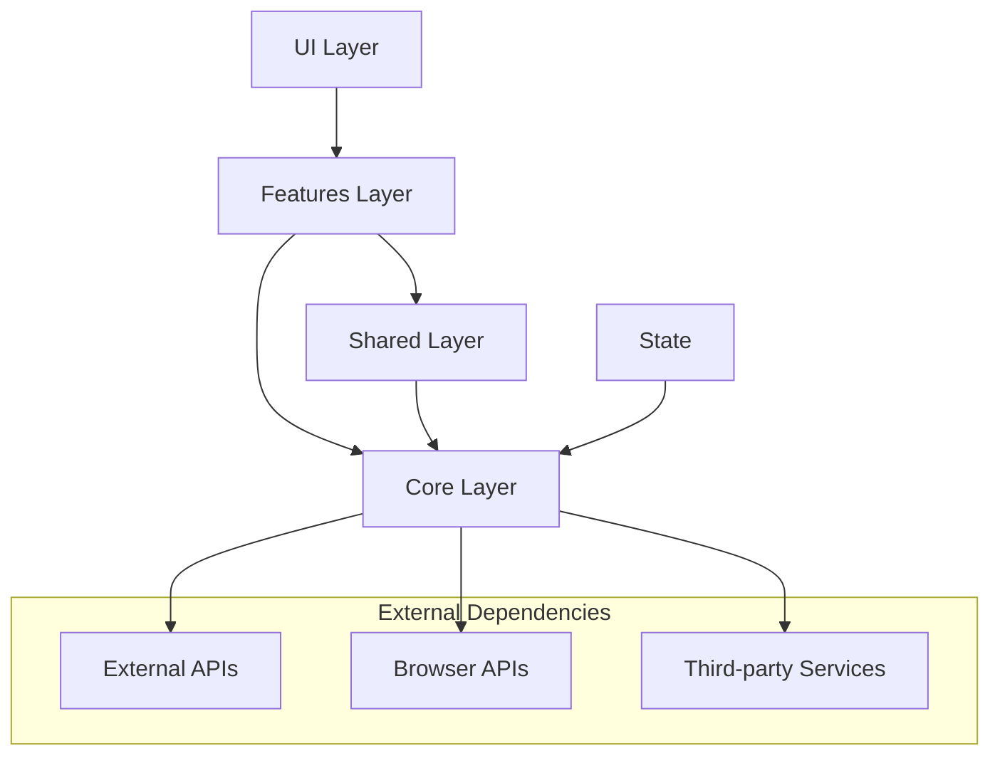
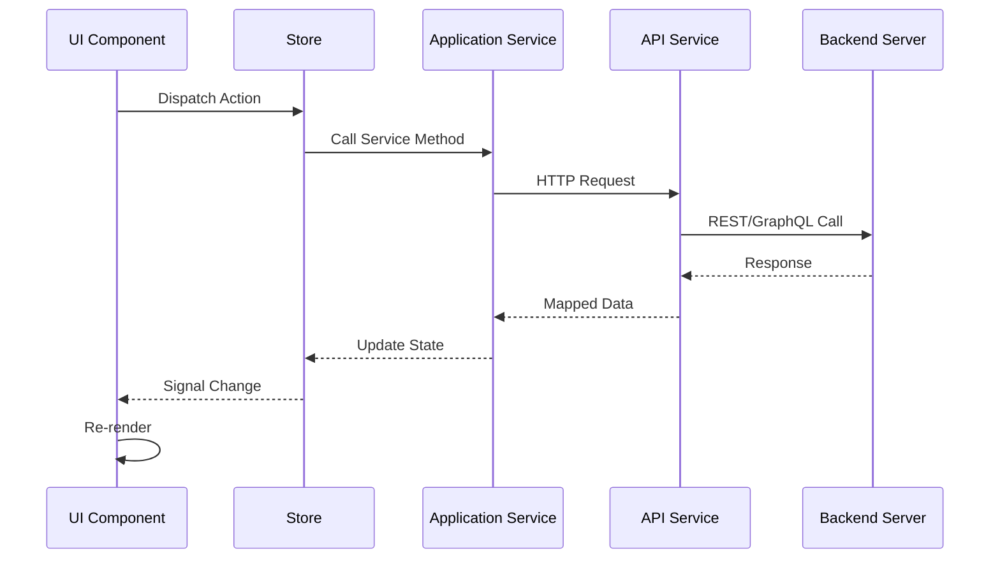

# 🏗️ Architecture Guide - Boukii Admin V5

> **Comprehensive architectural documentation for the enterprise Angular 18 application**

## 📋 Table of Contents

- [Overview](#overview)
- [Architectural Principles](#architectural-principles)
- [Layer Architecture](#layer-architecture)
- [Domain-Driven Design](#domain-driven-design)
- [State Management](#state-management)
- [Component Architecture](#component-architecture)
- [Service Architecture](#service-architecture)
- [Security Architecture](#security-architecture)
- [Performance Architecture](#performance-architecture)
- [Testing Architecture](#testing-architecture)

---

## Overview

Boukii Admin V5 implements a **Domain-Driven Design (DDD)** architecture with clear separation of concerns, leveraging Angular 18's standalone components and signals-based reactive programming.

### Core Architectural Goals

1. **Scalability** - Support team growth and feature expansion
2. **Maintainability** - Clear code organization and documentation
3. **Testability** - Comprehensive testing strategy
4. **Performance** - Optimized bundle size and runtime performance
5. **Security** - Defense-in-depth security implementation
6. **Developer Experience** - Modern tooling and automation

---

## Architectural Principles

### 🎯 SOLID Principles

**Single Responsibility Principle (SRP)**

```typescript
// ✅ Good - Single responsibility
@Injectable()
export class UserAuthService {
  public authenticate(credentials: LoginCredentials): Observable<AuthResult> {
    return this.http.post<AuthResult>('/auth/login', credentials);
  }
}

@Injectable()
export class UserProfileService {
  public getUserProfile(userId: string): Observable<UserProfile> {
    return this.http.get<UserProfile>(`/users/${userId}/profile`);
  }
}
```

**Open/Closed Principle (OCP)**

```typescript
// ✅ Good - Open for extension, closed for modification
export abstract class BaseHttpInterceptor implements HttpInterceptor {
  abstract intercept(req: HttpRequest<any>, next: HttpHandler): Observable<HttpEvent<any>>;

  protected addHeaders(req: HttpRequest<any>, headers: Record<string, string>): HttpRequest<any> {
    // Shared header logic
  }
}

export class AuthInterceptor extends BaseHttpInterceptor {
  intercept(req: HttpRequest<any>, next: HttpHandler): Observable<HttpEvent<any>> {
    // Auth-specific implementation
  }
}
```

**Dependency Inversion Principle (DIP)**

```typescript
// ✅ Good - Depend on abstractions
export abstract class StorageService {
  abstract setItem(key: string, value: any): void;
  abstract getItem<T>(key: string): T | null;
}

@Injectable()
export class LocalStorageService extends StorageService {
  setItem(key: string, value: any): void {
    localStorage.setItem(key, JSON.stringify(value));
  }
}
```

### 🔄 Reactive Programming

**Signals-First Approach**

```typescript
@Injectable()
export class UserStore {
  // State signals
  private readonly _users = signal<User[]>([]);
  private readonly _loading = signal<boolean>(false);
  private readonly _selectedUser = signal<User | null>(null);

  // Computed signals
  public readonly users = this._users.asReadonly();
  public readonly loading = this._loading.asReadonly();
  public readonly selectedUser = this._selectedUser.asReadonly();

  // Derived state
  public readonly userCount = computed(() => this._users().length);
  public readonly hasUsers = computed(() => this._users().length > 0);
}
```

### 🏛️ Immutability

**Immutable Updates**

```typescript
export class TodoStore {
  private readonly _todos = signal<Todo[]>([]);

  public addTodo(todo: CreateTodoRequest): void {
    this._todos.update((todos) => [...todos, { ...todo, id: generateId() }]);
  }

  public updateTodo(id: string, updates: Partial<Todo>): void {
    this._todos.update((todos) =>
      todos.map((todo) => (todo.id === id ? { ...todo, ...updates } : todo))
    );
  }
}
```

---

## Layer Architecture

### 📁 Directory Structure

```
src/app/
├── core/                    # Core Layer - Foundation services
│   ├── config/             # Application configuration
│   ├── guards/             # Route guards
│   ├── interceptors/       # HTTP interceptors
│   ├── models/             # Domain models and interfaces
│   ├── services/           # Core business services
│   └── stores/             # Global state stores
│
├── shared/                  # Shared Layer - Reusable components
│   ├── components/         # Shared UI components
│   ├── directives/         # Shared directives
│   └── pipes/              # Shared pipes
│
├── features/                # Feature Layer - Business features
│   ├── auth/               # Authentication feature
│   ├── dashboard/          # Dashboard feature
│   ├── users/              # User management feature
│   └── settings/           # Settings feature
│
├── ui/                      # UI Layer - Layout and base components
│   ├── app-shell/          # Main application shell
│   ├── theme-toggle/       # Theme switching component
│   └── layout/             # Layout components
│
└── state/                   # State Layer - Global state management
    ├── auth/               # Authentication state
    ├── ui/                 # UI state (theme, sidebar, etc.)
    └── data/               # Application data state
```

### 🔄 Layer Dependencies



### 📋 Layer Responsibilities

| Layer        | Responsibility                     | Examples                            |
| ------------ | ---------------------------------- | ----------------------------------- |
| **UI**       | Layout, shell, base components     | AppShell, Header, Sidebar           |
| **Features** | Business logic, feature components | Dashboard, UserList, Settings       |
| **Shared**   | Reusable UI components             | Button, Modal, Table                |
| **Core**     | Foundation services, models        | ApiService, AuthService, User model |
| **State**    | Global state management            | AuthStore, UIStore                  |

---

## Domain-Driven Design

### 🎯 Domain Models

**User Domain**

```typescript
// Domain Entity
export interface User {
  readonly id: UserId;
  readonly email: Email;
  readonly profile: UserProfile;
  readonly roles: Role[];
  readonly createdAt: Date;
  readonly updatedAt: Date;
}

// Value Objects
export type UserId = string & { readonly __brand: 'UserId' };
export type Email = string & { readonly __brand: 'Email' };

export interface UserProfile {
  readonly firstName: string;
  readonly lastName: string;
  readonly avatar?: string;
  readonly preferences: UserPreferences;
}

// Domain Services
@Injectable()
export class UserDomainService {
  public createUser(request: CreateUserRequest): User {
    return {
      id: this.generateUserId(),
      email: this.validateEmail(request.email),
      profile: this.createProfile(request.profile),
      roles: [Role.USER],
      createdAt: new Date(),
      updatedAt: new Date(),
    };
  }

  public canUserAccessResource(user: User, resource: Resource): boolean {
    return user.roles.some((role) =>
      this.permissionService.hasPermission(role, resource.requiredPermission)
    );
  }
}
```

**Booking Domain**

```typescript
export interface Booking {
  readonly id: BookingId;
  readonly userId: UserId;
  readonly serviceId: ServiceId;
  readonly timeSlot: TimeSlot;
  readonly status: BookingStatus;
  readonly payment: PaymentInfo;
  readonly metadata: BookingMetadata;
}

export enum BookingStatus {
  PENDING = 'pending',
  CONFIRMED = 'confirmed',
  CANCELLED = 'cancelled',
  COMPLETED = 'completed',
}

@Injectable()
export class BookingDomainService {
  public createBooking(request: CreateBookingRequest): Result<Booking, BookingError> {
    // Domain validation
    if (!this.isValidTimeSlot(request.timeSlot)) {
      return Result.failure(BookingError.INVALID_TIME_SLOT);
    }

    if (!this.isSlotAvailable(request.serviceId, request.timeSlot)) {
      return Result.failure(BookingError.SLOT_NOT_AVAILABLE);
    }

    return Result.success(this.buildBooking(request));
  }
}
```

### 🏛️ Repository Pattern

```typescript
// Repository Interface (Domain Layer)
export abstract class UserRepository {
  abstract findById(id: UserId): Observable<User | null>;
  abstract findByEmail(email: Email): Observable<User | null>;
  abstract save(user: User): Observable<User>;
  abstract delete(id: UserId): Observable<void>;
  abstract findAll(criteria: UserSearchCriteria): Observable<User[]>;
}

// Repository Implementation (Infrastructure Layer)
@Injectable()
export class HttpUserRepository extends UserRepository {
  constructor(private http: HttpClient) {
    super();
  }

  findById(id: UserId): Observable<User | null> {
    return this.http.get<UserDto>(`/users/${id}`).pipe(
      map((dto) => (dto ? this.toDomainUser(dto) : null)),
      catchError(() => of(null))
    );
  }

  private toDomainUser(dto: UserDto): User {
    return {
      id: dto.id as UserId,
      email: dto.email as Email,
      // ... mapping logic
    };
  }
}
```

### 📋 Application Services

```typescript
@Injectable()
export class UserApplicationService {
  constructor(
    private userRepository: UserRepository,
    private userDomainService: UserDomainService,
    private eventBus: EventBus
  ) {}

  public async createUser(command: CreateUserCommand): Promise<Result<User, ApplicationError>> {
    try {
      // Check business rules
      const existingUser = await firstValueFrom(this.userRepository.findByEmail(command.email));

      if (existingUser) {
        return Result.failure(ApplicationError.USER_ALREADY_EXISTS);
      }

      // Create domain entity
      const user = this.userDomainService.createUser(command);

      // Persist
      const savedUser = await firstValueFrom(this.userRepository.save(user));

      // Publish domain event
      this.eventBus.publish(new UserCreatedEvent(savedUser));

      return Result.success(savedUser);
    } catch (error) {
      return Result.failure(ApplicationError.UNEXPECTED_ERROR);
    }
  }
}
```

---

## State Management

### 🔄 Signals-Based Architecture

**Store Pattern**

```typescript
@Injectable()
export class AuthStore {
  // Private state signals
  private readonly _user = signal<User | null>(null);
  private readonly _isAuthenticated = signal<boolean>(false);
  private readonly _loading = signal<boolean>(false);
  private readonly _error = signal<string | null>(null);

  // Public readonly signals
  public readonly user = this._user.asReadonly();
  public readonly isAuthenticated = this._isAuthenticated.asReadonly();
  public readonly loading = this._loading.asReadonly();
  public readonly error = this._error.asReadonly();

  // Computed signals
  public readonly userDisplayName = computed(() => {
    const user = this._user();
    return user ? `${user.profile.firstName} ${user.profile.lastName}` : '';
  });

  public readonly hasRole = computed(() => (role: Role) => {
    const user = this._user();
    return user?.roles.includes(role) ?? false;
  });

  // Actions
  public login(credentials: LoginCredentials): void {
    this._loading.set(true);
    this._error.set(null);

    this.authService.login(credentials).subscribe({
      next: (result) => {
        this._user.set(result.user);
        this._isAuthenticated.set(true);
        this._loading.set(false);
      },
      error: (error) => {
        this._error.set(error.message);
        this._loading.set(false);
      },
    });
  }

  public logout(): void {
    this._user.set(null);
    this._isAuthenticated.set(false);
    this._error.set(null);
  }
}
```

**Store Composition**

```typescript
@Injectable()
export class AppStateService {
  constructor(
    private authStore: AuthStore,
    private uiStore: UIStore,
    private dataStore: DataStore
  ) {}

  // Composed state
  public readonly appState = computed(() => ({
    auth: {
      user: this.authStore.user(),
      isAuthenticated: this.authStore.isAuthenticated(),
      loading: this.authStore.loading(),
    },
    ui: {
      theme: this.uiStore.theme(),
      sidebarOpen: this.uiStore.sidebarOpen(),
      language: this.uiStore.language(),
    },
    data: {
      users: this.dataStore.users(),
      bookings: this.dataStore.bookings(),
      loading: this.dataStore.loading(),
    },
  }));

  // Global actions
  public initialize(): void {
    this.authStore.checkAuthentication();
    this.uiStore.loadPreferences();
    this.dataStore.loadInitialData();
  }
}
```

### 🔄 Side Effects Management

```typescript
@Injectable()
export class AuthEffects {
  constructor(
    private authService: AuthService,
    private router: Router,
    private notificationService: NotificationService
  ) {}

  // Login effect
  private readonly loginEffect = effect(() => {
    const isAuthenticated = this.authStore.isAuthenticated();
    const currentRoute = this.router.url;

    if (isAuthenticated && currentRoute.startsWith('/auth/')) {
      this.router.navigate(['/dashboard']);
    } else if (!isAuthenticated && !currentRoute.startsWith('/auth/')) {
      this.router.navigate(['/auth/login']);
    }
  });

  // Error notification effect
  private readonly errorEffect = effect(() => {
    const error = this.authStore.error();
    if (error) {
      this.notificationService.showError(error);
    }
  });

  // Token refresh effect
  private readonly tokenRefreshEffect = effect(() => {
    const user = this.authStore.user();
    if (user && this.shouldRefreshToken(user.tokenExpiresAt)) {
      this.authService.refreshToken().subscribe();
    }
  });
}
```

---

## Component Architecture

### 🧩 Component Patterns

**Smart vs Dumb Components**

```typescript
// Smart Component (Container)
@Component({
  selector: 'app-user-list',
  template: `
    <app-user-table
      [users]="users()"
      [loading]="loading()"
      (userSelected)="onUserSelected($event)"
      (userDeleted)="onUserDeleted($event)"
    >
    </app-user-table>
  `,
  changeDetection: ChangeDetectionStrategy.OnPush,
})
export class UserListComponent {
  protected readonly users = this.userStore.users;
  protected readonly loading = this.userStore.loading;

  constructor(private userStore: UserStore) {}

  protected onUserSelected(user: User): void {
    this.userStore.selectUser(user);
  }

  protected onUserDeleted(user: User): void {
    this.userStore.deleteUser(user.id);
  }
}

// Dumb Component (Presentation)
@Component({
  selector: 'app-user-table',
  template: `
    <table>
      @if (loading()) {
        <tr>
          <td colspan="3">Loading...</td>
        </tr>
      } @else {
        @for (user of users(); track user.id) {
          <tr>
            <td>{{ user.profile.firstName }}</td>
            <td>{{ user.email }}</td>
            <td>
              <button (click)="userSelected.emit(user)">Select</button>
              <button (click)="userDeleted.emit(user)">Delete</button>
            </td>
          </tr>
        }
      }
    </table>
  `,
  changeDetection: ChangeDetectionStrategy.OnPush,
})
export class UserTableComponent {
  @Input({ required: true }) users!: Signal<User[]>;
  @Input({ required: true }) loading!: Signal<boolean>;
  @Output() userSelected = new EventEmitter<User>();
  @Output() userDeleted = new EventEmitter<User>();
}
```

**Component Composition**

```typescript
@Component({
  selector: 'app-dashboard',
  template: `
    <div class="dashboard">
      <app-dashboard-header [user]="currentUser()"></app-dashboard-header>

      <div class="dashboard-content">
        <app-stats-widget [stats]="dashboardStats()"></app-stats-widget>
        <app-recent-bookings [bookings]="recentBookings()"></app-recent-bookings>
        <app-user-activity [activities]="userActivities()"></app-user-activity>
      </div>
    </div>
  `,
  changeDetection: ChangeDetectionStrategy.OnPush,
})
export class DashboardComponent implements OnInit {
  protected readonly currentUser = this.authStore.user;
  protected readonly dashboardStats = this.dashboardStore.stats;
  protected readonly recentBookings = this.dashboardStore.recentBookings;
  protected readonly userActivities = this.dashboardStore.userActivities;

  constructor(
    private authStore: AuthStore,
    private dashboardStore: DashboardStore
  ) {}

  ngOnInit(): void {
    this.dashboardStore.loadDashboardData();
  }
}
```

### 🎨 Design System Components

**Base Component**

```typescript
export abstract class BaseComponent {
  protected readonly destroy$ = new Subject<void>();

  ngOnDestroy(): void {
    this.destroy$.next();
    this.destroy$.complete();
  }
}

@Component({
  selector: 'app-button',
  template: `
    <button [class]="computedClasses()" [disabled]="disabled()" (click)="handleClick($event)">
      @if (loading()) {
        <app-spinner size="sm"></app-spinner>
      }
      <ng-content></ng-content>
    </button>
  `,
  changeDetection: ChangeDetectionStrategy.OnPush,
})
export class ButtonComponent {
  @Input() variant: 'primary' | 'secondary' | 'danger' = 'primary';
  @Input() size: 'sm' | 'md' | 'lg' = 'md';
  @Input() disabled = input<boolean>(false);
  @Input() loading = input<boolean>(false);
  @Output() clicked = new EventEmitter<MouseEvent>();

  protected readonly computedClasses = computed(() => `btn btn-${this.variant} btn-${this.size}`);

  protected handleClick(event: MouseEvent): void {
    if (!this.disabled() && !this.loading()) {
      this.clicked.emit(event);
    }
  }
}
```

---

## Service Architecture

### 🔧 Service Layers

**API Service Layer**

```typescript
@Injectable()
export class ApiService {
  private readonly baseUrl = environment.apiUrl;

  constructor(private http: HttpClient) {}

  public get<T>(endpoint: string, options?: HttpOptions): Observable<T> {
    return this.http.get<T>(`${this.baseUrl}${endpoint}`, options);
  }

  public post<T>(endpoint: string, body: any, options?: HttpOptions): Observable<T> {
    return this.http.post<T>(`${this.baseUrl}${endpoint}`, body, options);
  }

  public put<T>(endpoint: string, body: any, options?: HttpOptions): Observable<T> {
    return this.http.put<T>(`${this.baseUrl}${endpoint}`, body, options);
  }

  public delete<T>(endpoint: string, options?: HttpOptions): Observable<T> {
    return this.http.delete<T>(`${this.baseUrl}${endpoint}`, options);
  }
}

@Injectable()
export class UserApiService {
  constructor(private api: ApiService) {}

  public getUsers(params?: UserSearchParams): Observable<User[]> {
    return this.api
      .get<UserDto[]>('/users', { params })
      .pipe(map((dtos) => dtos.map((dto) => this.mapToUser(dto))));
  }

  public getUserById(id: string): Observable<User> {
    return this.api.get<UserDto>(`/users/${id}`).pipe(map((dto) => this.mapToUser(dto)));
  }

  private mapToUser(dto: UserDto): User {
    return {
      id: dto.id,
      email: dto.email,
      profile: {
        firstName: dto.firstName,
        lastName: dto.lastName,
        avatar: dto.avatar,
      },
      roles: dto.roles,
      createdAt: new Date(dto.createdAt),
      updatedAt: new Date(dto.updatedAt),
    };
  }
}
```

**Business Logic Services**

```typescript
@Injectable()
export class BookingService {
  constructor(
    private bookingApi: BookingApiService,
    private userService: UserService,
    private notificationService: NotificationService
  ) {}

  public async createBooking(
    request: CreateBookingRequest
  ): Promise<Result<Booking, BookingError>> {
    try {
      // Validate user permissions
      const user = await firstValueFrom(this.userService.getCurrentUser());
      if (!this.canUserCreateBooking(user, request)) {
        return Result.failure(BookingError.INSUFFICIENT_PERMISSIONS);
      }

      // Check availability
      const isAvailable = await firstValueFrom(
        this.bookingApi.checkAvailability(request.serviceId, request.timeSlot)
      );

      if (!isAvailable) {
        return Result.failure(BookingError.SLOT_NOT_AVAILABLE);
      }

      // Create booking
      const booking = await firstValueFrom(this.bookingApi.createBooking(request));

      // Send confirmation
      await this.notificationService.sendBookingConfirmation(booking);

      return Result.success(booking);
    } catch (error) {
      return Result.failure(BookingError.UNEXPECTED_ERROR);
    }
  }

  private canUserCreateBooking(user: User, request: CreateBookingRequest): boolean {
    return user.roles.some(
      (role) => role === Role.ADMIN || (role === Role.USER && request.userId === user.id)
    );
  }
}
```

### 🔄 Service Composition

```typescript
@Injectable()
export class DashboardService {
  constructor(
    private userService: UserService,
    private bookingService: BookingService,
    private analyticsService: AnalyticsService
  ) {}

  public getDashboardData(): Observable<DashboardData> {
    return combineLatest([
      this.userService.getUserStats(),
      this.bookingService.getBookingStats(),
      this.analyticsService.getRecentActivity(),
    ]).pipe(
      map(([userStats, bookingStats, recentActivity]) => ({
        userStats,
        bookingStats,
        recentActivity,
        lastUpdated: new Date(),
      }))
    );
  }
}
```

---

## Security Architecture

### 🔒 Authentication & Authorization

**JWT Token Management**

```typescript
@Injectable()
export class TokenService {
  private readonly TOKEN_KEY = 'auth_token';
  private readonly REFRESH_TOKEN_KEY = 'refresh_token';

  public setTokens(tokens: AuthTokens): void {
    this.storage.setItem(this.TOKEN_KEY, tokens.accessToken);
    this.storage.setItem(this.REFRESH_TOKEN_KEY, tokens.refreshToken);
  }

  public getAccessToken(): string | null {
    return this.storage.getItem(this.TOKEN_KEY);
  }

  public isTokenValid(token: string): boolean {
    try {
      const payload = this.decodeToken(token);
      return payload.exp > Date.now() / 1000;
    } catch {
      return false;
    }
  }

  public shouldRefreshToken(token: string): boolean {
    try {
      const payload = this.decodeToken(token);
      const expiresIn = payload.exp - Date.now() / 1000;
      return expiresIn < 300; // Refresh if expires in less than 5 minutes
    } catch {
      return false;
    }
  }
}
```

**Permission-Based Guards**

```typescript
@Injectable()
export class PermissionGuard implements CanActivate {
  constructor(
    private authStore: AuthStore,
    private permissionService: PermissionService,
    private router: Router
  ) {}

  canActivate(route: ActivatedRouteSnapshot): boolean {
    const user = this.authStore.user();
    if (!user) {
      this.router.navigate(['/auth/login']);
      return false;
    }

    const requiredPermissions = route.data['permissions'] as Permission[];
    if (!requiredPermissions || requiredPermissions.length === 0) {
      return true;
    }

    const hasPermission = requiredPermissions.every((permission) =>
      this.permissionService.hasPermission(user, permission)
    );

    if (!hasPermission) {
      this.router.navigate(['/access-denied']);
      return false;
    }

    return true;
  }
}

// Route configuration
const routes: Routes = [
  {
    path: 'admin',
    canActivate: [PermissionGuard],
    data: { permissions: [Permission.ADMIN_ACCESS] },
    children: [
      // Admin routes
    ],
  },
];
```

### 🛡️ Security Interceptors

**CSRF Protection**

```typescript
@Injectable()
export class CsrfInterceptor implements HttpInterceptor {
  private readonly CSRF_HEADER = 'X-CSRF-TOKEN';

  intercept(req: HttpRequest<any>, next: HttpHandler): Observable<HttpEvent<any>> {
    if (this.shouldAddCsrfToken(req)) {
      const csrfToken = this.getCsrfToken();
      if (csrfToken) {
        req = req.clone({
          setHeaders: {
            [this.CSRF_HEADER]: csrfToken,
          },
        });
      }
    }

    return next.handle(req);
  }

  private shouldAddCsrfToken(req: HttpRequest<any>): boolean {
    return (
      ['POST', 'PUT', 'PATCH', 'DELETE'].includes(req.method.toUpperCase()) &&
      req.url.startsWith(environment.apiUrl)
    );
  }
}
```

**Content Security Policy**

```typescript
export const SECURITY_HEADERS = {
  'Content-Security-Policy': `
    default-src 'self';
    script-src 'self' 'unsafe-inline';
    style-src 'self' 'unsafe-inline';
    img-src 'self' data: blob:;
    font-src 'self';
    connect-src 'self' ${environment.apiUrl};
    frame-ancestors 'none';
  `
    .replace(/\s+/g, ' ')
    .trim(),
  'X-Frame-Options': 'DENY',
  'X-Content-Type-Options': 'nosniff',
  'Referrer-Policy': 'strict-origin-when-cross-origin',
  'X-XSS-Protection': '1; mode=block',
};
```

---

## Performance Architecture

### ⚡ Optimization Strategies

**Lazy Loading**

```typescript
const routes: Routes = [
  {
    path: 'dashboard',
    loadComponent: () =>
      import('./features/dashboard/dashboard.component').then((m) => m.DashboardComponent),
  },
  {
    path: 'users',
    loadChildren: () => import('./features/users/users.routes').then((m) => m.USERS_ROUTES),
  },
];
```

**OnPush Change Detection**

```typescript
@Component({
  selector: 'app-user-list',
  changeDetection: ChangeDetectionStrategy.OnPush,
  template: `
    @for (user of users(); track user.id) {
      <app-user-item [user]="user" (selected)="onUserSelected($event)"> </app-user-item>
    }
  `,
})
export class UserListComponent {
  @Input({ required: true }) users = input.required<User[]>();
  @Output() userSelected = output<User>();

  protected onUserSelected(user: User): void {
    this.userSelected.emit(user);
  }
}
```

**Virtual Scrolling**

```typescript
@Component({
  selector: 'app-large-list',
  template: `
    <cdk-virtual-scroll-viewport itemSize="50" class="viewport">
      @for (item of items(); track item.id; virtualScroll) {
        <app-list-item [item]="item"></app-list-item>
      }
    </cdk-virtual-scroll-viewport>
  `,
})
export class LargeListComponent {
  @Input({ required: true }) items = input.required<ListItem[]>();
}
```

### 📦 Bundle Optimization

**Tree Shaking Configuration**

```typescript
// optimized-imports.ts
export { Component, Input, Output } from '@angular/core';
export { Observable, Subject, BehaviorSubject } from 'rxjs';
export { map, filter, switchMap, catchError } from 'rxjs/operators';

// Instead of importing entire libraries
// import * from '@angular/core'; // ❌ Bad
// import { Component, Input, Output } from '@angular/core'; // ✅ Good
```

**Code Splitting**

```typescript
export const APP_ROUTES: Routes = [
  {
    path: '',
    redirectTo: '/dashboard',
    pathMatch: 'full',
  },
  {
    path: 'auth',
    loadChildren: () => import('./features/auth/auth.routes').then((m) => m.AUTH_ROUTES),
  },
  {
    path: 'dashboard',
    loadChildren: () =>
      import('./features/dashboard/dashboard.routes').then((m) => m.DASHBOARD_ROUTES),
  },
];
```

---

## Testing Architecture

### 🧪 Testing Strategy

**Unit Testing**

```typescript
describe('UserService', () => {
  let service: UserService;
  let httpMock: HttpTestingController;

  beforeEach(() => {
    TestBed.configureTestingModule({
      imports: [HttpClientTestingModule],
      providers: [UserService],
    });

    service = TestBed.inject(UserService);
    httpMock = TestBed.inject(HttpTestingController);
  });

  it('should fetch users', () => {
    const mockUsers: User[] = [{ id: '1', email: 'test@example.com' /* ... */ }];

    service.getUsers().subscribe((users) => {
      expect(users).toEqual(mockUsers);
    });

    const req = httpMock.expectOne('/api/users');
    expect(req.request.method).toBe('GET');
    req.flush(mockUsers);
  });
});
```

**Component Testing**

```typescript
describe('UserListComponent', () => {
  let component: UserListComponent;
  let fixture: ComponentFixture<UserListComponent>;

  beforeEach(async () => {
    await TestBed.configureTestingModule({
      imports: [UserListComponent],
    }).compileComponents();

    fixture = TestBed.createComponent(UserListComponent);
    component = fixture.componentInstance;
  });

  it('should emit user selection', () => {
    const user = createMockUser();
    const spy = jest.spyOn(component.userSelected, 'emit');

    component.onUserSelected(user);

    expect(spy).toHaveBeenCalledWith(user);
  });
});
```

**Integration Testing**

```typescript
describe('Authentication Flow', () => {
  let authService: AuthService;
  let authStore: AuthStore;
  let router: Router;

  beforeEach(() => {
    TestBed.configureTestingModule({
      imports: [RouterTestingModule],
      providers: [AuthService, AuthStore],
    });

    authService = TestBed.inject(AuthService);
    authStore = TestBed.inject(AuthStore);
    router = TestBed.inject(Router);
  });

  it('should navigate to dashboard after successful login', async () => {
    const credentials = { email: 'test@example.com', password: 'password' };
    const mockUser = createMockUser();

    jest.spyOn(authService, 'login').mockReturnValue(of(mockUser));
    const navigateSpy = jest.spyOn(router, 'navigate');

    authStore.login(credentials);

    await fixture.whenStable();

    expect(authStore.user()).toEqual(mockUser);
    expect(authStore.isAuthenticated()).toBe(true);
    expect(navigateSpy).toHaveBeenCalledWith(['/dashboard']);
  });
});
```

---

## 🔄 Data Flow Architecture



## 📋 Best Practices Summary

### ✅ Do's

1. **Use TypeScript strictly** - Enable all strict flags
2. **Implement OnPush strategy** - For better performance
3. **Follow DDD principles** - Clear domain boundaries
4. **Use signals for state** - Reactive and performant
5. **Write comprehensive tests** - Unit, integration, and E2E
6. **Document architecture decisions** - Keep ADRs updated
7. **Validate at boundaries** - Input validation and sanitization
8. **Handle errors gracefully** - User-friendly error messages

### ❌ Don'ts

1. **Don't use any type** - Always type your data
2. **Don't mutate state directly** - Use immutable updates
3. **Don't ignore memory leaks** - Unsubscribe observables
4. **Don't skip error handling** - Handle all error cases
5. **Don't violate layer boundaries** - Respect architecture layers
6. **Don't ignore security** - Validate and sanitize inputs
7. **Don't skip documentation** - Document complex logic
8. **Don't ignore performance** - Monitor bundle size and runtime

---

_Last updated: 2025-08-16_

_For questions or clarifications, contact the architecture team._
