# V5 Context Headers - Documentación Técnica

## 🎯 Resumen

El sistema V5 de Boukii utiliza un sistema de headers de contexto para manejar la seguridad multi-tenant (multi-escuela/multi-temporada). Esta documentación describe qué headers se requieren para cada tipo de endpoint.

## 🛡️ Middleware de Contexto

### 1. SchoolContextMiddleware (`school.context.middleware`)
**Requiere solo contexto de escuela**
- `Authorization: Bearer {token}` - **OBLIGATORIO**
- `X-School-ID: {school_id}` - **OBLIGATORIO**

**Usado para:**
- `/v5/seasons` (GET) - Listar temporadas
- `/v5/seasons` (POST) - Crear temporada  
- Otros endpoints que gestionan temporadas pero no operan sobre una específica

### 2. ContextMiddleware (`context.middleware`)
**Requiere contexto completo (escuela + temporada)**
- `Authorization: Bearer {token}` - **OBLIGATORIO**  
- `X-School-ID: {school_id}` - **OBLIGATORIO**
- `X-Season-ID: {season_id}` - **OBLIGATORIO**

**Usado para:**
- `/v5/seasons/current` - Temporada actual
- `/v5/seasons/{id}` - Operaciones sobre temporada específica
- `/v5/dashboard/*` - Dashboard y estadísticas
- Endpoints de reservas, clientes, cursos, etc.

## 📊 Obtención de Context Data

Los middleware obtienen el contexto en este orden de prioridad:

### School ID:
1. `token.context_data.school_id` (del token Sanctum)
2. `token.context_data.school_slug` → resolve a school_id
3. Header `X-School-ID`
4. Query param `school_id`
5. Body param `school_id`

### Season ID:
1. `token.season_id` (campo directo del token)
2. `token.context_data.season_id` (del JSON context_data)
3. Header `X-Season-ID`  
4. Query param `season_id`
5. Body param `season_id`

## 🔄 Flujo de Autenticación V5

```mermaid
graph TD
    A[Usuario hace login] --> B[selectSchool]
    B --> C[Token con school_id en context_data]
    C --> D{¿Listar seasons?}
    D -->|Sí| E[GET /v5/seasons - Solo X-School-ID]
    D -->|No| F[selectSeason]
    F --> G[Token con season_id en context_data] 
    G --> H[Acceso completo - X-School-ID + X-Season-ID]
```



## 🚨 Casos de Error Comunes

### 401 UNAUTHORIZED
- Token faltante o inválido
- Usuario no autenticado

### 403 FORBIDDEN - School Context
- `X-School-ID` faltante cuando requerido
- Usuario sin acceso a la escuela especificada
- Escuela inactiva o no encontrada

### 403 FORBIDDEN - Season Context  
- `X-Season-ID` faltante cuando requerido
- Usuario sin permisos en la temporada
- Temporada inactiva o no pertenece a la escuela

## 🔧 Frontend Integration

### AuthV5Interceptor
El interceptor automáticamente añade headers según el contexto:

```typescript
// Automáticamente añade:
headers['Authorization'] = `Bearer ${token}`;

// Si hay school context:
headers['X-School-ID'] = schoolId;

// Si hay season context:  
headers['X-Season-ID'] = seasonId;
```

### ApiV5Service
Todos los métodos pasan por el interceptor:
```typescript
// ✅ CORRECTO - Usa ApiV5Service
this.apiV5Service.get('seasons') // Headers añadidos automáticamente

// ❌ INCORRECTO - HttpClient directo
this.http.get('/v5/seasons') // No pasa por interceptor
```

## 📋 Endpoints por Middleware

### Solo School Context (`school.context.middleware`)
- `GET /v5/seasons` - Listar temporadas de la escuela
- `POST /v5/seasons` - Crear nueva temporada

### Context Completo (`context.middleware`)
- `GET /v5/seasons/current` - Temporada activa
- `GET /v5/seasons/{id}` - Ver temporada específica
- `PUT /v5/seasons/{id}` - Actualizar temporada
- `DELETE /v5/seasons/{id}` - Eliminar temporada
- `GET /v5/dashboard/stats` - Estadísticas del dashboard
- Todos los endpoints de gestión (bookings, clients, etc.)

## ✅ Validación de Headers

### Desarrollo/Debug
Usar endpoints de debug para verificar contexto:
- `POST /v5/debug-raw-token` - Info del token sin middleware
- `POST /v5/debug-token` - Info con middleware aplicado

### Headers de Respuesta
Los middleware añaden headers informativos:
- `X-School-Context: {school_id}`
- `X-School-Name: {school_name}`  
- `X-Season-Context: {season_id}` (solo con context completo)
- `X-Season-Name: {season_name}` (solo con context completo)

---

**Actualizado:** Enero 2025  
**Versión:** V5.1.0