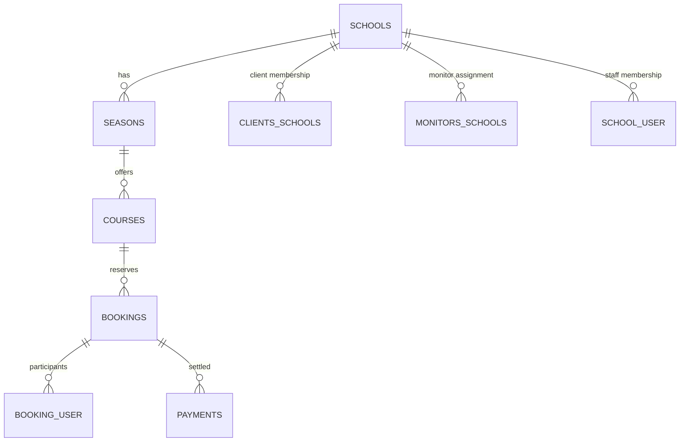

# V5 Data Contract

This document describes the database contract for Boukii V5. It covers the entity
relationships, tenancy model, uniqueness constraints and soft-delete behavior.

## ER diagram

## Tenancy columns

Most business tables are scoped by school and season. A typical record includes:

| Column       | Description                         |
|--------------|-------------------------------------|
| `school_id`  | Tenant identifier for the school    |
| `season_id`  | Season context within the school    |

These columns appear on entities such as `courses`, `bookings` and `payments` to
ensure tenant isolation.

## Pivot tables

The following pivots manage many-to-many relations:

| Pivot              | Purpose                          | Unique key                     |
|--------------------|----------------------------------|--------------------------------|
| `school_user`      | Links users to schools           | `user_id`, `school_id`         |
| `clients_schools`  | Associates clients with schools  | `client_id`, `school_id`       |
| `monitors_schools` | Assigns monitors to schools      | `monitor_id`, `school_id`      |
| `booking_user`     | Participants in a booking        | `booking_id`, `user_id`        |

Each pivot record stores timestamps and a `deleted_at` column to support soft
removal of relationships.

## Integrity rules

* **Foreign keys** enforce valid references between parent and child tables.
* **Composite unique constraints** combine tenant columns with business keys
  (for example, `courses` enforce uniqueness on `school_id`, `season_id`, and
  a course code).
* **Global uniqueness** applies to fields like `users.email` and `schools.slug`.

## Soft delete policy

Most tables use Laravel's `deleted_at` timestamp. Records remain in the database
and are excluded from queries via the `SoftDeletes` trait. Pivot tables also
implement soft deletes, allowing relationships to be restored when needed.
