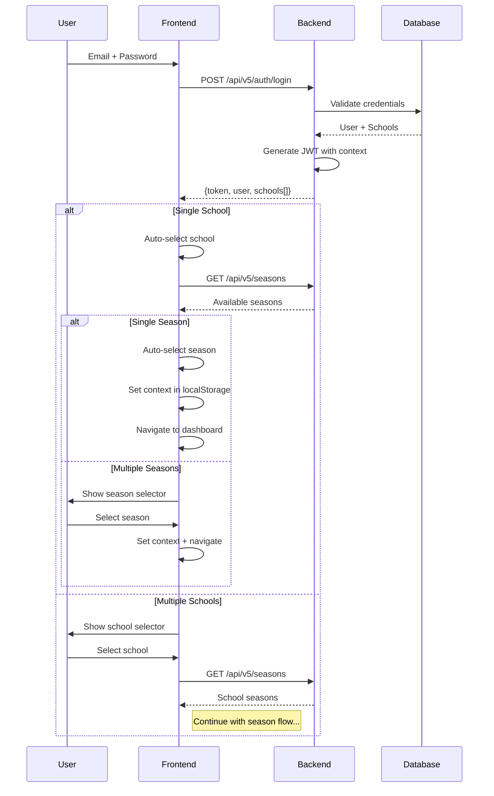

# Boukii V5 - Arquitectura Técnica Detallada

## 📋 Índice
1. [Frontend Architecture (Angular 16)](#frontend-architecture)
2. [Backend Architecture (Laravel 10+)](#backend-architecture)  
3. [Multi-Tenant Architecture](#multi-tenant-architecture)
4. [Authentication & Authorization](#authentication--authorization)
5. [API Design & Communication](#api-design--communication)
6. [Database Design](#database-design)
7. [Security Architecture](#security-architecture)
8. [Performance & Scalability](#performance--scalability)

---

## Frontend Architecture (Angular 16)

### 🏗 Estructura del Proyecto
```
src/
├── @vex/                           # Vex Theme Framework
│   ├── components/                 # Componentes base del tema
│   ├── layout/                     # Layouts (sidenav, toolbar, footer)
│   ├── styles/                     # Estilos globales y theme
│   └── config/                     # Configuración del tema
├── app/
│   ├── core/                       # 🔧 Core legacy services
│   │   ├── services/               # Servicios globales legacy
│   │   └── guards/                 # Guards de autenticación legacy
│   ├── pages/                      # 📱 Páginas legacy
│   │   ├── analytics/              # Módulo analytics legacy
│   │   ├── bookings/               # Módulo reservas legacy
│   │   ├── courses/                # Módulo cursos legacy
│   │   └── [otros módulos]
│   ├── service/                    # 🔧 Servicios legacy globales
│   │   ├── api.service.ts          # Cliente HTTP legacy
│   │   ├── auth.service.ts         # Auth service legacy
│   │   └── [otros servicios]
│   └── v5/                         # 🚀 Nueva arquitectura V5
│       ├── core/                   # Núcleo V5
│       ├── features/               # Módulos de características V5
│       ├── shared/                 # Componentes compartidos V5
│       └── layout/                 # Layouts específicos V5
├── assets/                         # Recursos estáticos
├── environments/                   # Configuraciones por entorno
└── styles/                         # Estilos globales del proyecto
```

### 🎯 Arquitectura V5 Core (`src/app/v5/core/`)

#### Guards de Seguridad
```typescript
// src/app/v5/core/guards/
├── auth-v5.guard.ts              # Autenticación V5
├── season-context.guard.ts       # Validación contexto temporada
├── role-hierarchy.guard.ts       # Jerarquía de roles
└── permission.guard.ts           # Permisos granulares
```

**AuthV5Guard**:
- Valida JWT token en localStorage
- Redirect a /auth/login si no hay token
- Inyecta headers de autenticación

**SeasonContextGuard**:
- Valida presencia de school_id y season_id
- Redirect a selección de contexto si falta
- Preserva URL destino para redirect post-context

#### Services Centrales
```typescript
// src/app/v5/core/services/
├── api-v5.service.ts             # Cliente HTTP principal V5
├── auth-v5.service.ts            # Gestión autenticación
├── context.service.ts            # Gestión contexto school/season
├── permission.service.ts         # Validación permisos frontend
└── notification.service.ts       # Sistema notificaciones
```

**ApiV5Service**:
```typescript
class ApiV5Service {
  private baseUrl = environment.apiUrl + '/v5';
  
  // Auto-injection de context headers
  private getHeaders(): HttpHeaders {
    return new HttpHeaders({
      'Authorization': `Bearer ${this.getToken()}`,
      'X-School-ID': this.context.schoolId,
      'X-Season-ID': this.context.seasonId
    });
  }
  
  // Métodos CRUD con context automático
  get<T>(endpoint: string): Observable<T> { }
  post<T>(endpoint: string, data: any): Observable<T> { }
  // ... otros métodos
}
```

#### HTTP Interceptors
```typescript
// src/app/v5/core/interceptors/
├── auth-v5.interceptor.ts        # Inyección headers auth + context
├── loading.interceptor.ts        # Estado global de loading
├── error.interceptor.ts          # Manejo centralizado errores
└── cache.interceptor.ts          # Cache inteligente responses
```

### 🎨 Features Architecture (`src/app/v5/features/`)

#### Estructura por Módulo
```
features/
├── dashboard/                    # Dashboard V5
│   ├── dashboard.module.ts
│   ├── components/
│   │   ├── stats-cards/
│   │   ├── charts/
│   │   └── activity-feed/
│   ├── services/
│   │   └── dashboard.service.ts
│   └── pages/
│       └── dashboard.component.ts
├── clients/                      # Gestión clientes
├── courses/                      # Gestión cursos  
├── bookings/                     # Gestión reservas
├── monitors/                     # Gestión monitores
└── administration/               # Admin panel
```

#### Patrón de Componente Estándar
```typescript
// Estructura estándar para cada feature component
@Component({
  selector: 'v5-feature-list',
  template: `
    <div class="v5-container">
      <v5-header [title]="title" [actions]="headerActions">
      <v5-data-table [data]="data$ | async" [columns]="columns">
      <v5-pagination [meta]="meta$ | async">
    </div>
  `
})
export class FeatureListComponent implements OnInit, OnDestroy {
  data$ = this.service.getAll();
  meta$ = this.service.getMeta();
  
  constructor(private service: FeatureService) {}
}
```

---

## Backend Architecture (Laravel 10+)

### 🏗 Estructura del Proyecto
```
app/
├── V5/                           # 🚀 Arquitectura V5
│   ├── Controllers/              # Controladores V5
│   ├── Middleware/               # Middleware específico V5
│   ├── Services/                 # Servicios de negocio V5
│   ├── Requests/                 # Form Requests V5
│   └── Resources/                # API Resources V5
├── Http/                         # 🔧 Estructura Laravel estándar
│   ├── Controllers/              # Controladores legacy
│   ├── Middleware/               # Middleware global
│   └── Requests/                 # Validaciones legacy
├── Models/                       # Modelos Eloquent
├── Services/                     # Servicios de negocio legacy
└── Repositories/                 # Patrón Repository
```

### 🎯 V5 Controllers (`app/V5/Controllers/`)

#### Base Controller
```php
// app/V5/BaseV5Controller.php
class BaseV5Controller extends Controller
{
    protected function getCurrentSchool(): School
    {
        return request()->get('current_school');
    }
    
    protected function getCurrentSeason(): Season  
    {
        return request()->get('current_season');
    }
    
    protected function successResponse($data, $message = 'Success', $meta = [])
    {
        return response()->json([
            'success' => true,
            'data' => $data,
            'message' => $message,
            'meta' => array_merge([
                'school_id' => $this->getCurrentSchool()?->id,
                'season_id' => $this->getCurrentSeason()?->id,
            ], $meta)
        ]);
    }
}
```

#### Estructura de Controladores V5
```php
// app/V5/Controllers/
├── AuthController.php            # Auth V5: login, schools, seasons
├── DashboardController.php       # Stats y métricas
├── SchoolController.php          # Gestión escuelas
├── SeasonController.php          # Gestión temporadas
├── ClientController.php          # CRUD clientes
├── CourseController.php          # CRUD cursos
├── BookingController.php         # CRUD reservas
└── MonitorController.php         # CRUD monitores
```

### 🛡️ V5 Middleware (`app/V5/Middleware/`)

#### Context Middleware (Crítico)
```php
// app/V5/Middleware/ContextMiddleware.php
class ContextMiddleware
{
    public function handle($request, Closure $next)
    {
        // 1. Validar autenticación
        $user = auth()->guard('sanctum')->user();
        if (!$user) {
            return response()->json(['error' => 'Unauthenticated'], 401);
        }
        
        // 2. Extraer contexto (token o headers)
        $schoolId = $request->header('X-School-ID') ?? $this->getSchoolFromToken();
        $seasonId = $request->header('X-Season-ID') ?? $this->getSeasonFromToken();
        
        // 3. Validar acceso a school y season
        $school = $this->validateSchoolAccess($user, $schoolId);
        $season = $this->validateSeasonAccess($school, $seasonId);
        
        // 4. Inyectar en request para controladores
        $request->merge([
            'current_user' => $user,
            'current_school' => $school, 
            'current_season' => $season
        ]);
        
        return $next($request);
    }
}
```

### 🔐 Permission System

#### 4-Level Hierarchy
```yaml
Global Level:
  - global.admin       # Super admin
  - global.support     # Support team

School Level:  
  - school.admin       # School owner
  - school.manager     # School manager
  - school.staff       # School employee
  - school.view        # Read-only school access

Season Level:
  - season.admin       # Full season control
  - season.manager     # Season management
  - season.view        # Read-only season

Resource Level:
  - booking.create, booking.read, booking.update, booking.delete
  - client.create, client.read, client.update, client.delete  
  - course.create, course.read, course.update, course.delete
  - monitor.create, monitor.read, monitor.update, monitor.delete
```

#### Permission Inheritance
```php
// Jerarquía automática de permisos
global.admin → school.admin → season.admin → resource.admin
global.admin → school.manager → season.manager → resource.manage
// ... etc
```

---

## Multi-Tenant Architecture

### 🏢 School-Based Isolation

#### Data Segregation
```sql
-- Todas las tablas principales incluyen school_id
users:        user_id, school_id, email, ...
clients:      client_id, school_id, name, ...
courses:      course_id, school_id, name, ...
bookings:     booking_id, school_id, client_id, ...
```

#### Query Scoping Automático
```php
// Model con scope automático
class Client extends Model
{
    protected static function booted()
    {
        static::addGlobalScope('school', function ($builder) {
            if (request()->has('current_school')) {
                $builder->where('school_id', request()->get('current_school')->id);
            }
        });
    }
}

// Todas las queries automáticamente filtran por school
Client::all(); // Solo clientes de la escuela actual
```

### ⏰ Season Context

#### Temporal Scoping
```php
// Queries contextualizadas por temporada
$bookings = Booking::whereBelongsToCurrentSeason()->get();
$courses = Course::withSeasonContext()->active()->get();
```

#### Season Transitions
```php
// Manejo de transiciones entre temporadas
class SeasonService
{
    public function createNewSeason($schoolId, $data)
    {
        DB::transaction(function() use ($schoolId, $data) {
            // 1. Cerrar temporada actual
            Season::where('school_id', $schoolId)
                  ->where('is_current', true)
                  ->update(['is_current' => false]);
            
            // 2. Crear nueva temporada
            $newSeason = Season::create([
                'school_id' => $schoolId,
                'is_current' => true,
                ...$data
            ]);
            
            // 3. Migrar configuraciones
            $this->migrateSeasonSettings($schoolId, $newSeason);
        });
    }
}
```

---

## Authentication & Authorization

### 🔑 JWT + Context Flow

#### Login Flow Completo


#### JWT Token Structure
```json
{
  "sub": "user_id",
  "email": "admin@boukii-v5.com",
  "schools": [
    {
      "id": 2,
      "name": "École de Ski Les Diablerets",
      "permissions": ["school.admin", "season.admin"]
    }
  ],
  "default_school_id": 2,
  "iat": 1692000000,
  "exp": 1692086400
}
```

### 🛡️ Context Headers Validation

#### Frontend Interceptor
```typescript
@Injectable()
export class AuthV5Interceptor implements HttpInterceptor {
  intercept(req: HttpRequest<any>, next: HttpHandler) {
    const context = this.contextService.getCurrentContext();
    
    if (context.schoolId && context.seasonId) {
      req = req.clone({
        headers: req.headers
          .set('Authorization', `Bearer ${this.getToken()}`)
          .set('X-School-ID', context.schoolId.toString())
          .set('X-Season-ID', context.seasonId.toString())
      });
    }
    
    return next.handle(req);
  }
}
```

#### Backend Validation
```php
// ContextMiddleware validation
private function validateContext($user, $schoolId, $seasonId)
{
    // Verificar acceso a escuela
    if (!$user->hasAccessToSchool($schoolId)) {
        throw new UnauthorizedException('No access to school');
    }
    
    // Verificar temporada válida para escuela
    $season = Season::where('school_id', $schoolId)
                   ->where('id', $seasonId)
                   ->where('is_active', true)
                   ->first();
                   
    if (!$season) {
        throw new ValidationException('Invalid season for school');
    }
    
    return [$school, $season];
}
```

---

## API Design & Communication

### 📡 RESTful API Structure

#### Endpoint Patterns
```yaml
# Authentication (no context required)
POST   /api/v5/auth/login
POST   /api/v5/auth/logout
GET    /api/v5/auth/me

# School Context (auth required, no context)
GET    /api/v5/schools
POST   /api/v5/schools/{id}/select

# Season Context (auth + school context)
GET    /api/v5/seasons
POST   /api/v5/seasons

# Resource Endpoints (full context required)
GET    /api/v5/dashboard/stats
GET    /api/v5/clients
POST   /api/v5/clients
GET    /api/v5/clients/{id}
PUT    /api/v5/clients/{id}
DELETE /api/v5/clients/{id}
```

#### Standardized Responses
```json
// Success Response
{
  "success": true,
  "data": {...},
  "message": "Operation completed",
  "meta": {
    "school_id": 2,
    "season_id": 1,
    "pagination": {
      "current_page": 1,
      "total": 100,
      "per_page": 15
    }
  }
}

// Error Response  
{
  "success": false,
  "message": "Validation failed",
  "errors": {
    "name": ["The name field is required"],
    "email": ["Invalid email format"]
  },
  "meta": {
    "school_id": 2,
    "season_id": 1,
    "error_code": "VALIDATION_ERROR"
  }
}
```

### 🔄 Error Handling

#### Frontend Error Interceptor
```typescript
@Injectable()
export class ErrorInterceptor implements HttpInterceptor {
  intercept(req: HttpRequest<any>, next: HttpHandler) {
    return next.handle(req).pipe(
      catchError((error: HttpErrorResponse) => {
        switch (error.status) {
          case 401:
            this.authService.logout();
            this.router.navigate(['/auth/login']);
            break;
          case 403:
            this.notificationService.showError('Access denied');
            break;
          case 400:
            if (error.error.message?.includes('context')) {
              this.contextService.resetContext();
              this.router.navigate(['/auth/school-selection']);
            }
            break;
        }
        return throwError(error);
      })
    );
  }
}
```

---

## Database Design

### 📊 Core Tables Structure

#### Multi-Tenancy Core
```sql
-- Schools (Tenants principales)
CREATE TABLE schools (
    id BIGINT PRIMARY KEY AUTO_INCREMENT,
    name VARCHAR(255) NOT NULL,
    slug VARCHAR(100) UNIQUE,
    settings JSON,
    is_active BOOLEAN DEFAULT true,
    created_at TIMESTAMP,
    updated_at TIMESTAMP,
    INDEX idx_schools_active (is_active)
);

-- Seasons (Contexto temporal)
CREATE TABLE seasons (
    id BIGINT PRIMARY KEY AUTO_INCREMENT,
    school_id BIGINT NOT NULL,
    name VARCHAR(255) NOT NULL,
    start_date DATE,
    end_date DATE,
    is_active BOOLEAN DEFAULT true,
    is_current BOOLEAN DEFAULT false,
    settings JSON,
    created_at TIMESTAMP,
    updated_at TIMESTAMP,
    
    FOREIGN KEY (school_id) REFERENCES schools(id),
    UNIQUE KEY unique_current_season (school_id, is_current),
    INDEX idx_seasons_school_active (school_id, is_active)
);

-- User-Season-Role (Permisos granulares)
CREATE TABLE user_season_roles (
    id BIGINT PRIMARY KEY AUTO_INCREMENT,
    user_id BIGINT NOT NULL,
    school_id BIGINT NOT NULL,
    season_id BIGINT NULL, -- NULL = school-level role
    role_name VARCHAR(100) NOT NULL,
    permissions JSON,
    granted_by BIGINT NULL,
    granted_at TIMESTAMP DEFAULT CURRENT_TIMESTAMP,
    expires_at TIMESTAMP NULL,
    
    FOREIGN KEY (user_id) REFERENCES users(id),
    FOREIGN KEY (school_id) REFERENCES schools(id), 
    FOREIGN KEY (season_id) REFERENCES seasons(id),
    FOREIGN KEY (granted_by) REFERENCES users(id),
    
    UNIQUE KEY unique_user_season_role (user_id, school_id, season_id, role_name),
    INDEX idx_user_school (user_id, school_id)
);
```

#### Business Data Tables
```sql
-- Clients (Multi-school)
CREATE TABLE clients (
    id BIGINT PRIMARY KEY AUTO_INCREMENT,
    school_id BIGINT NOT NULL,
    first_name VARCHAR(100) NOT NULL,
    last_name VARCHAR(100) NOT NULL,
    email VARCHAR(255),
    phone VARCHAR(50),
    date_of_birth DATE,
    emergency_contact JSON,
    preferences JSON,
    created_at TIMESTAMP,
    updated_at TIMESTAMP,
    
    FOREIGN KEY (school_id) REFERENCES schools(id),
    INDEX idx_clients_school (school_id),
    INDEX idx_clients_email (school_id, email)
);

-- Courses (Contextual por season)
CREATE TABLE courses (
    id BIGINT PRIMARY KEY AUTO_INCREMENT,
    school_id BIGINT NOT NULL,
    season_id BIGINT NOT NULL,
    name VARCHAR(255) NOT NULL,
    description TEXT,
    level ENUM('beginner', 'intermediate', 'advanced'),
    max_participants INT DEFAULT 8,
    price_structure JSON,
    schedule JSON,
    is_active BOOLEAN DEFAULT true,
    created_at TIMESTAMP,
    updated_at TIMESTAMP,
    
    FOREIGN KEY (school_id) REFERENCES schools(id),
    FOREIGN KEY (season_id) REFERENCES seasons(id),
    INDEX idx_courses_season (season_id, is_active)
);

-- Bookings (Core business entity)
CREATE TABLE bookings (
    id BIGINT PRIMARY KEY AUTO_INCREMENT,
    school_id BIGINT NOT NULL,
    season_id BIGINT NOT NULL,
    client_id BIGINT NOT NULL,
    course_id BIGINT NOT NULL,
    booking_date DATE NOT NULL,
    status ENUM('pending', 'confirmed', 'cancelled', 'completed') DEFAULT 'pending',
    participants INT DEFAULT 1,
    total_price DECIMAL(10,2),
    payment_status ENUM('unpaid', 'partial', 'paid') DEFAULT 'unpaid',
    special_requests TEXT,
    metadata JSON,
    created_at TIMESTAMP,
    updated_at TIMESTAMP,
    
    FOREIGN KEY (school_id) REFERENCES schools(id),
    FOREIGN KEY (season_id) REFERENCES seasons(id),
    FOREIGN KEY (client_id) REFERENCES clients(id),
    FOREIGN KEY (course_id) REFERENCES courses(id),
    
    INDEX idx_bookings_season_date (season_id, booking_date),
    INDEX idx_bookings_client (client_id),
    INDEX idx_bookings_status (status, payment_status)
);
```

### 🔄 Migration Strategy

#### Version Control
```php
// Migration naming convention
2025_08_13_000001_create_v5_schools_table.php
2025_08_13_000002_create_v5_seasons_table.php
2025_08_13_000003_create_v5_user_season_roles_table.php
```

#### Rollback Support
```php
public function down()
{
    // Todas las migrations deben ser reversibles
    Schema::dropIfExists('user_season_roles');
    Schema::dropIfExists('seasons');
    Schema::dropIfExists('schools');
}
```

---

## Security Architecture

### 🔐 Multi-Layer Security

#### 1. Authentication Layer
- **JWT Tokens**: Stateless authentication
- **Token Expiry**: Short-lived tokens (24h)
- **Refresh Mechanism**: Automatic token renewal
- **Secure Storage**: HttpOnly cookies + localStorage

#### 2. Authorization Layer
- **Context Validation**: School/Season access verification
- **Permission Hierarchy**: 4-level permission system
- **Resource Guards**: Granular resource access
- **Admin Overrides**: Emergency access patterns

#### 3. Data Protection Layer
- **Multi-Tenant Isolation**: Automatic school_id scoping
- **Query Filtering**: Global model scopes
- **Data Encryption**: Sensitive fields encrypted
- **Audit Logging**: Complete action history

#### 4. Transport Security
- **HTTPS Only**: All communications encrypted
- **CORS Configuration**: Restrictive cross-origin policy
- **CSP Headers**: Content Security Policy
- **Rate Limiting**: API endpoint protection

### 🛡️ Audit & Monitoring

#### Security Events Logging
```php
// app/V5/Services/AuditService.php
class AuditService
{
    public function logSecurityEvent($event, $details = [])
    {
        SecurityLog::create([
            'event_type' => $event,
            'user_id' => auth()->id(),
            'school_id' => request()->get('current_school')?->id,
            'season_id' => request()->get('current_season')?->id,
            'ip_address' => request()->ip(),
            'user_agent' => request()->userAgent(),
            'details' => $details,
            'severity' => $this->calculateSeverity($event),
            'occurred_at' => now()
        ]);
    }
}
```

#### Monitored Events
```yaml
Authentication:
  - login_success, login_failure
  - token_refresh, token_expiry
  - password_reset, password_change

Authorization:
  - permission_denied, role_escalation_attempt
  - context_violation, invalid_school_access
  - suspicious_activity, multiple_failures

Data Access:
  - sensitive_data_access, bulk_export
  - admin_override_used, emergency_access
  - data_modification, deletion_events
```

---

## Performance & Scalability

### ⚡ Frontend Optimization

#### Code Splitting
```typescript
// Lazy loading por módulos
const routes: Routes = [
  {
    path: 'dashboard',
    loadChildren: () => import('./v5/features/dashboard/dashboard.module').then(m => m.DashboardModule)
  },
  {
    path: 'clients', 
    loadChildren: () => import('./v5/features/clients/clients.module').then(m => m.ClientsModule)
  }
];
```

#### State Management
```typescript
// Services con RxJS para estado
@Injectable()
export class ClientsService {
  private clients$ = new BehaviorSubject<Client[]>([]);
  private loading$ = new BehaviorSubject<boolean>(false);
  
  // Cache inteligente
  getClients(): Observable<Client[]> {
    if (this.clients$.value.length === 0) {
      this.loadClients();
    }
    return this.clients$.asObservable();
  }
}
```

### 🚀 Backend Optimization

#### Database Optimization
```php
// Eager loading inteligente
$bookings = Booking::with(['client', 'course', 'payments'])
                  ->whereBelongsToCurrentSeason()
                  ->latest()
                  ->paginate(15);

// Query optimization
$stats = DB::table('bookings')
           ->selectRaw('COUNT(*) as total, SUM(total_price) as revenue')
           ->where('school_id', $currentSchool->id)
           ->where('season_id', $currentSeason->id) 
           ->whereDate('created_at', '>=', now()->subDays(30))
           ->first();
```

#### Caching Strategy
```php
// Multi-level cache
class DashboardService 
{
    public function getStats($schoolId, $seasonId)
    {
        $cacheKey = "dashboard_stats_{$schoolId}_{$seasonId}";
        
        return Cache::remember($cacheKey, 300, function() use ($schoolId, $seasonId) {
            return $this->calculateStats($schoolId, $seasonId);
        });
    }
}
```

#### Background Jobs
```php
// Procesamiento asíncrono
class ProcessBookingJob implements ShouldQueue
{
    public function handle()
    {
        // Procesamiento pesado en background
        $this->sendConfirmationEmail();
        $this->updateInventory(); 
        $this->generateInvoice();
        $this->notifyMonitors();
    }
}
```

### 📊 Monitoring & Metrics

#### Application Metrics
```yaml
Performance:
  - Response time per endpoint
  - Database query execution time
  - Cache hit/miss ratios
  - Memory usage patterns

Business Metrics:
  - Bookings per hour/day/season
  - Revenue per school/season
  - User activity patterns
  - Feature usage analytics

Error Tracking:
  - Exception rates
  - Failed authentication attempts
  - Permission violations
  - System errors
```

#### Health Checks
```php
// app/V5/Controllers/HealthController.php
public function check()
{
    return [
        'status' => 'ok',
        'database' => $this->checkDatabase(),
        'cache' => $this->checkCache(),
        'queue' => $this->checkQueue(),
        'services' => [
            'auth' => $this->checkAuthService(),
            'permissions' => $this->checkPermissionService()
        ],
        'timestamp' => now()->toISOString()
    ];
}
```

---

*Última actualización: 2025-08-13*  
*Documento sincronizado automáticamente entre repositorios*