# Boukii V5 - Flujo de Autenticación y Autorización

## 📋 Índice
1. [Sistema de Autenticación Multi-Tenant](#sistema-de-autenticación-multi-tenant)
2. [Flujo de Login Completo](#flujo-de-login-completo)
3. [Contexto School y Season](#contexto-school-y-season)
4. [Sistema de Permisos 4-Nivel](#sistema-de-permisos-4-nivel)
5. [JWT Token Management](#jwt-token-management)
6. [Guards y Interceptors](#guards-y-interceptors)
7. [Casos Edge y Error Handling](#casos-edge-y-error-handling)
8. [Implementación Técnica](#implementación-técnica)

---

## Sistema de Autenticación Multi-Tenant

### 🎯 Arquitectura de Seguridad

Boukii V5 implementa un sistema de **4 capas de seguridad** que valida el acceso del usuario en múltiples niveles:

```mermaid
graph TD
    A[🔐 Authentication] --> B[🏢 School Context]
    B --> C[📅 Season Context]  
    C --> D[🛡️ Permission Check]
    D --> E[✅ Access Granted]
    
    A --> F[❌ Invalid Token]
    B --> G[❌ No School Access]
    C --> H[❌ Invalid Season]
    D --> I[❌ Insufficient Permissions]
    
    F --> J[🔄 Redirect Login]
    G --> J
    H --> K[🔄 Season Selector]
    I --> L[⛔ Access Denied]
```



### 🏢 Multi-Tenancy Levels

#### 1. **Global Level**
- Super administradores del sistema
- Acceso a todas las escuelas y configuraciones

#### 2. **School Level (Tenant)**  
- Aislamiento completo de datos por escuela
- Administradores y staff de escuela específica
- Sin acceso cruzado entre escuelas

#### 3. **Season Level (Context)**
- Operaciones dentro de temporada específica
- Cada escuela maneja múltiples temporadas
- Contexto temporal para todas las operaciones

#### 4. **Resource Level**
- Permisos granulares sobre recursos específicos
- CRUD permissions por entidad (clients, courses, bookings)

---

## Flujo de Login Completo

### 🚀 Secuencia de Autenticación


### 📱 Estados de la UI

#### Login States
```typescript
interface LoginState {
  loading: boolean;
  user: User | null;
  schools: School[];
  selectedSchool: School | null;
  seasons: Season[];
  selectedSeason: Season | null;
  error: string | null;
}

// Estados posibles
type LoginFlow = 
  | 'initial'           // Mostrar form login
  | 'authenticating'    // Validando credenciales
  | 'school-selection'  // Seleccionar escuela
  | 'season-selection'  // Seleccionar temporada
  | 'context-ready'     // Contexto establecido
  | 'dashboard';        // Navegando a dashboard
```

### 🎯 Decision Points

#### 1. **Post-Login School Flow**
```typescript
// Lógica de selección automática
private handlePostLogin(response: LoginResponse) {
  if (response.schools.length === 1) {
    // Auto-selección de escuela única
    this.selectSchool(response.schools[0]);
  } else {
    // Mostrar selector de escuelas múltiples
    this.router.navigate(['/auth/school-selection']);
  }
}
```

#### 2. **Post-School Season Flow**
```typescript
private handleSchoolSelected(school: School) {
  this.seasonService.getAvailableSeasons(school.id).subscribe(seasons => {
    if (seasons.length === 1) {
      // Auto-selección de temporada única
      this.selectSeason(seasons[0]);
    } else {
      // Modal selector de temporadas
      this.openSeasonSelector(seasons);
    }
  });
}
```

---

## Contexto School y Season

### 🏢 School Context Management

#### Context Service
```typescript
@Injectable()
export class ContextService {
  private currentContext$ = new BehaviorSubject<Context | null>(null);
  
  // Estado actual del contexto
  getCurrentContext(): Observable<Context | null> {
    return this.currentContext$.asObservable();
  }
  
  // Establecer contexto completo
  setContext(school: School, season: Season): void {
    const context = { school, season };
    this.currentContext$.next(context);
    this.persistContext(context);
  }
  
  // Persistencia en localStorage
  private persistContext(context: Context): void {
    localStorage.setItem('boukii_context', JSON.stringify({
      school_id: context.school.id,
      season_id: context.season.id,
      school_name: context.school.name,
      season_name: context.season.name
    }));
  }
}
```

#### Context Restoration
```typescript
// Al inicializar la aplicación
export class AppComponent implements OnInit {
  ngOnInit() {
    this.restoreContext();
  }
  
  private restoreContext() {
    const stored = localStorage.getItem('boukii_context');
    if (stored) {
      const context = JSON.parse(stored);
      // Validar que el contexto sigue siendo válido
      this.contextService.validateAndRestoreContext(context);
    }
  }
}
```

### 📅 Season Context

#### Context Headers Injection
```typescript
@Injectable()
export class AuthV5Interceptor implements HttpInterceptor {
  intercept(req: HttpRequest<any>, next: HttpHandler): Observable<HttpEvent<any>> {
    const token = this.getToken();
    const context = this.contextService.getCurrentContextValue();
    
    if (token && context) {
      req = req.clone({
        headers: req.headers
          .set('Authorization', `Bearer ${token}`)
          .set('X-School-ID', context.school.id.toString())
          .set('X-Season-ID', context.season.id.toString())
      });
    }
    
    return next.handle(req);
  }
}
```

#### Backend Context Validation
```php
// app/V5/Middleware/ContextMiddleware.php
class ContextMiddleware
{
    public function handle($request, Closure $next)
    {
        // 1. Validar autenticación Sanctum
        $user = auth()->guard('sanctum')->user();
        if (!$user) {
            return $this->unauthorizedResponse();
        }
        
        // 2. Extraer contexto de headers
        $schoolId = $request->header('X-School-ID');
        $seasonId = $request->header('X-Season-ID');
        
        if (!$schoolId || !$seasonId) {
            return $this->invalidContextResponse();
        }
        
        // 3. Validar acceso a escuela
        $school = $this->validateSchoolAccess($user, $schoolId);
        if (!$school) {
            return $this->forbiddenResponse('No access to school');
        }
        
        // 4. Validar temporada para escuela
        $season = $this->validateSeasonAccess($school, $seasonId);
        if (!$season) {
            return $this->invalidSeasonResponse();
        }
        
        // 5. Inyectar contexto en request
        $request->merge([
            'current_user' => $user,
            'current_school' => $school,
            'current_season' => $season
        ]);
        
        return $next($request);
    }
}
```

---

## Sistema de Permisos 4-Nivel

### 🎯 Jerarquía de Permisos

#### Level 1: Global Permissions
```yaml
global.admin:           # Super admin - acceso total
  - Gestión de todas las escuelas
  - Configuración del sistema
  - Acceso de emergencia

global.support:         # Soporte técnico  
  - Acceso read-only a escuelas
  - Debugging y troubleshooting
  - Sin modificación de datos críticos
```

#### Level 2: School Permissions
```yaml
school.admin:           # Propietario/Admin de escuela
  - Gestión completa de la escuela
  - Crear/modificar temporadas
  - Gestión de usuarios de escuela
  - Configuración de escuela

school.manager:         # Manager de escuela
  - Operaciones día a día
  - Gestión de staff
  - Reportes y analytics
  - Sin configuración crítica

school.staff:           # Staff de escuela
  - Operaciones básicas
  - Gestión de reservas y clientes
  - Sin gestión de usuarios
  - Sin acceso a configuración

school.view:            # Solo lectura
  - Visualización de datos
  - Reportes básicos
  - Sin modificaciones
```

#### Level 3: Season Permissions
```yaml
season.admin:           # Admin de temporada
  - Control total de la temporada
  - Gestión de cursos y precios
  - Configuración temporal
  - Cierre/apertura de temporada

season.manager:         # Manager de temporada
  - Gestión operativa diaria
  - Programación de cursos
  - Gestión de monitores
  - Reportes de temporada

season.view:            # Solo lectura de temporada
  - Consulta de datos temporada
  - Reportes básicos
  - Sin modificaciones
```

#### Level 4: Resource Permissions  
```yaml
# Clientes
client.create:          # Crear nuevos clientes
client.read:            # Ver información clientes
client.update:          # Modificar clientes existentes
client.delete:          # Eliminar clientes

# Cursos
course.create:          # Crear cursos
course.read:            # Ver cursos
course.update:          # Modificar cursos
course.delete:          # Eliminar cursos

# Reservas
booking.create:         # Crear reservas
booking.read:           # Ver reservas
booking.update:         # Modificar reservas  
booking.delete:         # Cancelar reservas
booking.payment:        # Gestionar pagos

# Monitores
monitor.create:         # Crear monitores
monitor.read:           # Ver monitores
monitor.update:         # Modificar monitores
monitor.delete:         # Eliminar monitores
monitor.assign:         # Asignar a cursos
```

### 🔄 Permission Inheritance

#### Herencia Automática
```php
// Ejemplo de herencia de permisos
class PermissionService
{
    public function checkPermission($user, $permission, $context)
    {
        // 1. Check direct resource permission
        if ($user->hasResourcePermission($permission, $context)) {
            return true;
        }
        
        // 2. Check season-level permission
        if ($user->hasSeasonPermission('admin', $context->season)) {
            return true; // season.admin has all resource permissions
        }
        
        // 3. Check school-level permission  
        if ($user->hasSchoolPermission('admin', $context->school)) {
            return true; // school.admin has all season permissions
        }
        
        // 4. Check global-level permission
        if ($user->hasGlobalPermission('admin')) {
            return true; // global.admin has all permissions
        }
        
        return false;
    }
}
```

---

## JWT Token Management

### 🔑 Token Structure

#### JWT Payload
```json
{
  "sub": "123",                     // User ID
  "email": "admin@school.com",
  "name": "Admin User",
  "schools": [                      // Array of accessible schools
    {
      "id": 2,
      "name": "École de Ski Les Diablerets",
      "permissions": [
        "school.admin",
        "season.admin"  
      ]
    },
    {
      "id": 5,
      "name": "Ski Club Verbier",
      "permissions": [
        "school.manager"
      ]
    }
  ],
  "global_permissions": [],         // Global permissions if any
  "default_school_id": 2,          // Preferred school
  "iat": 1692000000,               // Issued at
  "exp": 1692086400                // Expires at (24h later)
}
```

#### Token Generation (Backend)
```php
// app/V5/Services/AuthService.php
class AuthService
{
    public function generateToken(User $user): string
    {
        $schools = $user->schools()->with('seasons')->get()->map(function($school) use ($user) {
            return [
                'id' => $school->id,
                'name' => $school->name,
                'permissions' => $user->getPermissionsForSchool($school->id)
            ];
        });
        
        $payload = [
            'sub' => $user->id,
            'email' => $user->email,
            'name' => $user->name,
            'schools' => $schools,
            'global_permissions' => $user->getGlobalPermissions(),
            'default_school_id' => $user->default_school_id ?? $schools->first()['id'],
            'iat' => now()->timestamp,
            'exp' => now()->addHours(24)->timestamp
        ];
        
        return JWT::encode($payload, config('app.jwt_secret'), 'HS256');
    }
}
```

### 🔄 Token Validation & Refresh

#### Frontend Token Management
```typescript
@Injectable()
export class AuthV5Service {
  private tokenRefreshThreshold = 300; // 5 minutes before expiry
  
  // Auto-refresh token si está cerca de expirar
  checkTokenExpiry(): void {
    const token = this.getToken();
    if (token) {
      const payload = this.decodeToken(token);
      const timeToExpiry = payload.exp - (Date.now() / 1000);
      
      if (timeToExpiry < this.tokenRefreshThreshold) {
        this.refreshToken().subscribe();
      }
    }
  }
  
  // Refresh automático
  refreshToken(): Observable<LoginResponse> {
    return this.http.post<LoginResponse>('/api/v5/auth/refresh', {})
      .pipe(
        tap(response => this.storeToken(response.token)),
        catchError(error => {
          this.logout(); // Token no se puede refrescar
          return throwError(error);
        })
      );
  }
}
```

#### Backend Token Refresh
```php
// app/V5/Controllers/AuthController.php
public function refresh(Request $request)
{
    $user = auth()->guard('sanctum')->user();
    
    if (!$user) {
        return response()->json(['error' => 'Unauthorized'], 401);
    }
    
    // Revoke current token
    $request->user()->currentAccessToken()->delete();
    
    // Generate new token
    $newToken = $this->authService->generateToken($user);
    
    return $this->successResponse([
        'token' => $newToken,
        'user' => $user,
        'expires_at' => now()->addHours(24)->toISOString()
    ]);
}
```

---

## Guards y Interceptors

### 🛡️ Frontend Guards

#### AuthV5Guard
```typescript
@Injectable()
export class AuthV5Guard implements CanActivate {
  constructor(
    private authService: AuthV5Service,
    private router: Router
  ) {}
  
  canActivate(): boolean {
    if (this.authService.isAuthenticated()) {
      return true;
    }
    
    this.router.navigate(['/auth/login']);
    return false;
  }
}
```

#### SeasonContextGuard
```typescript
@Injectable()
export class SeasonContextGuard implements CanActivate {
  constructor(
    private contextService: ContextService,
    private router: Router
  ) {}
  
  canActivate(): boolean {
    const context = this.contextService.getCurrentContextValue();
    
    if (context && context.school && context.season) {
      return true;
    }
    
    // Guardar URL destino para redirect post-context
    this.router.navigate(['/auth/school-selection']);
    return false;
  }
}
```

#### Permission Guard
```typescript
@Injectable()
export class PermissionGuard implements CanActivate {
  canActivate(route: ActivatedRouteSnapshot): boolean {
    const requiredPermission = route.data['permission'];
    
    if (!requiredPermission) {
      return true; // No permission required
    }
    
    return this.permissionService.hasPermission(requiredPermission);
  }
}
```

### 🔄 HTTP Interceptors

#### Auth Interceptor
```typescript
@Injectable()
export class AuthV5Interceptor implements HttpInterceptor {
  intercept(req: HttpRequest<any>, next: HttpHandler): Observable<HttpEvent<any>> {
    // Skip auth for auth endpoints
    if (req.url.includes('/auth/')) {
      return next.handle(req);
    }
    
    const token = this.authService.getToken();
    const context = this.contextService.getCurrentContextValue();
    
    if (token) {
      req = req.clone({
        headers: req.headers.set('Authorization', `Bearer ${token}`)
      });
    }
    
    // Add context headers for V5 API calls
    if (req.url.includes('/api/v5/') && context) {
      req = req.clone({
        headers: req.headers
          .set('X-School-ID', context.school.id.toString())
          .set('X-Season-ID', context.season.id.toString())
      });
    }
    
    return next.handle(req);
  }
}
```

#### Error Interceptor
```typescript
@Injectable()
export class ErrorInterceptor implements HttpInterceptor {
  intercept(req: HttpRequest<any>, next: HttpHandler): Observable<HttpEvent<any>> {
    return next.handle(req).pipe(
      catchError((error: HttpErrorResponse) => {
        switch (error.status) {
          case 401:
            this.handleUnauthorized();
            break;
          case 403:  
            this.handleForbidden();
            break;
          case 400:
            if (error.error.message?.includes('context')) {
              this.handleInvalidContext();
            }
            break;
        }
        return throwError(error);
      })
    );
  }
  
  private handleUnauthorized(): void {
    this.authService.logout();
    this.router.navigate(['/auth/login']);
  }
  
  private handleInvalidContext(): void {
    this.contextService.clearContext();
    this.router.navigate(['/auth/school-selection']);
  }
}
```

---

## Casos Edge y Error Handling

### 🚨 Scenarios de Error

#### 1. **Token Expiry During Navigation**
```typescript
// Manejo automático de token expirado
private handleTokenExpiry(): void {
  this.notificationService.showWarning('Session expired. Please login again.');
  this.authService.logout();
  this.router.navigate(['/auth/login']);
}
```

#### 2. **School Access Revoked**
```typescript
// Usuario perdió acceso a escuela
private handleSchoolAccessRevoked(): void {
  this.contextService.clearContext();
  this.notificationService.showError('Access to school has been revoked.');
  
  // Check if user has access to other schools
  const availableSchools = this.authService.getAvailableSchools();
  if (availableSchools.length > 0) {
    this.router.navigate(['/auth/school-selection']);
  } else {
    this.authService.logout();
    this.router.navigate(['/auth/login']);
  }
}
```

#### 3. **Season Deactivated**
```typescript
// Temporada fue desactivada  
private handleSeasonDeactivated(): void {
  this.contextService.clearSeasonContext();
  this.notificationService.showWarning('Current season is no longer active.');
  this.router.navigate(['/auth/season-selection']);
}
```

#### 4. **Concurrent Login Detection**
```typescript
// Detectar login desde otro dispositivo
private handleConcurrentLogin(): void {
  this.notificationService.showError('You have been logged in from another device.');
  this.authService.logout();
  this.router.navigate(['/auth/login']);
}
```

### ⚠️ Fallback Strategies

#### Network Error Handling
```typescript
@Injectable()
export class OfflineService {
  // Cache para operaciones offline
  private offlineQueue: QueuedOperation[] = [];
  
  // Detectar estado de conexión
  isOnline(): boolean {
    return navigator.onLine;
  }
  
  // Queue operations cuando offline
  queueOperation(operation: QueuedOperation): void {
    this.offlineQueue.push(operation);
  }
  
  // Procesar queue cuando vuelve conexión
  processOfflineQueue(): void {
    this.offlineQueue.forEach(op => this.executeOperation(op));
    this.offlineQueue = [];
  }
}
```

---

## Implementación Técnica

### 🔧 Configuración de Rutas

#### Angular Routing
```typescript
// app-routing.module.ts
const routes: Routes = [
  // Rutas públicas
  { path: 'auth/login', component: LoginComponent },
  { path: 'auth/forgot-password', component: ForgotPasswordComponent },
  
  // Rutas con auth pero sin contexto
  { 
    path: 'auth/school-selection', 
    component: SchoolSelectionComponent,
    canActivate: [AuthV5Guard]
  },
  
  // Rutas con contexto completo
  {
    path: 'dashboard',
    component: DashboardComponent,
    canActivate: [AuthV5Guard, SeasonContextGuard]
  },
  {
    path: 'clients',
    loadChildren: () => import('./v5/features/clients/clients.module').then(m => m.ClientsModule),
    canActivate: [AuthV5Guard, SeasonContextGuard],
    data: { permission: 'client.read' }
  },
  
  // Redirect por defecto
  { path: '', redirectTo: '/dashboard', pathMatch: 'full' },
  { path: '**', redirectTo: '/dashboard' }
];
```

#### Laravel Routes
```php
// routes/api/v5.php
Route::group(['prefix' => 'v5'], function () {
    // Auth routes (no middleware)
    Route::post('auth/login', [AuthController::class, 'login']);
    Route::post('auth/forgot-password', [AuthController::class, 'forgotPassword']);
    
    // Authenticated routes (token required)
    Route::middleware(['auth:sanctum'])->group(function () {
        Route::post('auth/logout', [AuthController::class, 'logout']);
        Route::post('auth/refresh', [AuthController::class, 'refresh']);
        Route::get('auth/me', [AuthController::class, 'me']);
        
        // School selection (no context required)
        Route::get('schools', [SchoolController::class, 'index']);
        Route::post('schools/{id}/select', [SchoolController::class, 'select']);
        
        // Context required routes
        Route::middleware(['context.middleware'])->group(function () {
            Route::get('seasons', [SeasonController::class, 'index']);
            Route::post('seasons', [SeasonController::class, 'store']);
            
            // Permission protected routes
            Route::middleware(['role.permission.middleware:client.read'])->group(function () {
                Route::get('clients', [ClientController::class, 'index']);
                Route::get('clients/{id}', [ClientController::class, 'show']);
            });
            
            Route::middleware(['role.permission.middleware:client.create'])->group(function () {
                Route::post('clients', [ClientController::class, 'store']);
            });
        });
    });
});
```

### 🧪 Testing Strategy

#### E2E Test Scenarios
```typescript
// cypress/e2e/auth-flow.cy.ts
describe('Authentication Flow', () => {
  it('should handle single school, single season flow', () => {
    cy.visit('/auth/login');
    cy.get('[data-cy=email]').type('admin@school.com');
    cy.get('[data-cy=password]').type('password');
    cy.get('[data-cy=login-btn]').click();
    
    // Should auto-select school and season, redirect to dashboard
    cy.url().should('include', '/dashboard');
    cy.get('[data-cy=current-context]').should('contain', 'School Name - Season Name');
  });
  
  it('should handle multi-school selection', () => {
    cy.visit('/auth/login');
    // Login as multi-school user
    
    cy.url().should('include', '/auth/school-selection');
    cy.get('[data-cy=school-card]:first').click();
    cy.url().should('include', '/dashboard');
  });
});
```

---

*Última actualización: 2025-08-13*  
*Documento sincronizado automáticamente entre repositorios*