# Módulo de Equipamiento - Boukii V5

## 📋 Resumen Ejecutivo

El módulo de equipamiento permite gestionar el inventario de material deportivo con capacidades de alquiler independiente e integración completa con el sistema de reservas. Implementa control multi-tenant por escuela/temporada con gestión automatizada de stock.

## 🎯 Características Principales

### Gestión de Inventario
- **Catálogo Multi-categoría**: Esquís, botas, cascos, tablas, etc.
- **Control de Stock**: Seguimiento en tiempo real por tallas y tipos
- **Estado del Equipamiento**: Disponible, en uso, mantenimiento, dañado
- **Ubicación Física**: Tracking de almacenes y ubicaciones

### Sistema de Alquiler
- **Alquiler Independiente**: Sin necesidad de reservar cursos
- **Integración con Reservas**: Equipamiento incluido en bookings
- **Pricing Dinámico**: Precios por categoría, temporada y duración
- **Check-in/Check-out**: Gestión de entrega y devolución

### Multi-tenancy
- **Aislamiento por Escuela**: Inventario separado por school_id
- **Contexto Temporal**: Disponibilidad por season_id
- **Permisos Granulares**: Control de acceso por roles

## 🗄️ Arquitectura de Base de Datos

### Tablas Principales

#### equipment_categories
```sql
CREATE TABLE equipment_categories (
    id BIGINT PRIMARY KEY,
    school_id BIGINT NOT NULL,
    name VARCHAR(100) NOT NULL,
    slug VARCHAR(100) NOT NULL,
    description TEXT,
    pricing_rules JSON,
    is_active BOOLEAN DEFAULT true,
    created_at TIMESTAMP,
    updated_at TIMESTAMP,
    
    FOREIGN KEY (school_id) REFERENCES schools(id) ON DELETE CASCADE,
    UNIQUE KEY (school_id, slug)
);
```

#### equipment_items
```sql
CREATE TABLE equipment_items (
    id BIGINT PRIMARY KEY,
    school_id BIGINT NOT NULL,
    category_id BIGINT NOT NULL,
    name VARCHAR(200) NOT NULL,
    brand VARCHAR(100),
    model VARCHAR(100),
    size_info VARCHAR(50),
    barcode VARCHAR(100) UNIQUE,
    status ENUM('available', 'rented', 'maintenance', 'damaged', 'retired'),
    condition_notes TEXT,
    location VARCHAR(100),
    purchase_date DATE,
    purchase_price DECIMAL(10,2),
    created_at TIMESTAMP,
    updated_at TIMESTAMP,
    
    FOREIGN KEY (school_id) REFERENCES schools(id) ON DELETE CASCADE,
    FOREIGN KEY (category_id) REFERENCES equipment_categories(id) ON DELETE CASCADE,
    INDEX idx_school_category (school_id, category_id),
    INDEX idx_status (status),
    INDEX idx_barcode (barcode)
);
```

#### equipment_rentals
```sql
CREATE TABLE equipment_rentals (
    id BIGINT PRIMARY KEY,
    school_id BIGINT NOT NULL,
    season_id BIGINT NOT NULL,
    client_id BIGINT NOT NULL,
    booking_id BIGINT NULL,
    rental_code VARCHAR(20) NOT NULL,
    status ENUM('pending', 'active', 'returned', 'overdue', 'damaged'),
    start_date DATETIME NOT NULL,
    end_date DATETIME NOT NULL,
    actual_return_date DATETIME NULL,
    total_price DECIMAL(10,2) NOT NULL,
    deposit_amount DECIMAL(10,2) DEFAULT 0,
    notes TEXT,
    created_by BIGINT NOT NULL,
    created_at TIMESTAMP,
    updated_at TIMESTAMP,
    
    FOREIGN KEY (school_id) REFERENCES schools(id) ON DELETE CASCADE,
    FOREIGN KEY (season_id) REFERENCES seasons(id) ON DELETE CASCADE,
    FOREIGN KEY (client_id) REFERENCES clients(id) ON DELETE CASCADE,
    FOREIGN KEY (booking_id) REFERENCES bookings(id) ON DELETE SET NULL,
    FOREIGN KEY (created_by) REFERENCES users(id),
    UNIQUE KEY (school_id, rental_code),
    INDEX idx_school_season (school_id, season_id),
    INDEX idx_dates (start_date, end_date),
    INDEX idx_status (status)
);
```

#### equipment_rental_items
```sql
CREATE TABLE equipment_rental_items (
    id BIGINT PRIMARY KEY,
    rental_id BIGINT NOT NULL,
    item_id BIGINT NOT NULL,
    quantity INT DEFAULT 1,
    unit_price DECIMAL(10,2) NOT NULL,
    condition_out TEXT,
    condition_in TEXT NULL,
    damage_fee DECIMAL(10,2) DEFAULT 0,
    
    FOREIGN KEY (rental_id) REFERENCES equipment_rentals(id) ON DELETE CASCADE,
    FOREIGN KEY (item_id) REFERENCES equipment_items(id) ON DELETE CASCADE,
    UNIQUE KEY (rental_id, item_id)
);
```

## 🔄 Flujos de Negocio

### 1. Alquiler Independiente

```mermaid
sequenceDiagram
    participant C as Cliente
    participant F as Frontend
    participant A as API
    participant D as Database
    
    C->>F: Selecciona equipamiento
    F->>A: POST /equipment/check-availability
    A->>D: Verificar stock por fechas
    D-->>A: Stock disponible
    A-->>F: Disponibilidad confirmada
    
    C->>F: Confirma alquiler
    F->>A: POST /equipment/rentals
    A->>D: Crear rental + rental_items
    A->>D: Actualizar status items
    A-->>F: Rental creado
    F-->>C: Código de alquiler
```



### 2. Integración con Reservas


### 3. Check-in / Check-out

```mermaid
sequenceDiagram
    participant S as Staff
    participant F as Frontend
    participant A as API
    participant D as Database
    
    Note over S,D: Check-out (Entrega)
    S->>F: Escanea código alquiler
    F->>A: GET /rentals/{code}
    A-->>F: Detalles del alquiler
    S->>F: Verifica condición items
    F->>A: POST /rentals/{id}/checkout
    A->>D: Actualizar status a 'active'
    
    Note over S,D: Check-in (Devolución)
    S->>F: Escanea código alquiler
    F->>A: GET /rentals/{code}/return
    A-->>F: Items a devolver
    S->>F: Inspecciona condición
    F->>A: POST /rentals/{id}/checkin
    A->>D: Procesar devolución + fees
```



## 🛠️ API Endpoints

### Equipment Management
```typescript
// Equipment Categories
GET    /api/v5/equipment/categories
POST   /api/v5/equipment/categories
PUT    /api/v5/equipment/categories/{id}
DELETE /api/v5/equipment/categories/{id}

// Equipment Items  
GET    /api/v5/equipment/items
POST   /api/v5/equipment/items
PUT    /api/v5/equipment/items/{id}
DELETE /api/v5/equipment/items/{id}
POST   /api/v5/equipment/items/bulk-import

// Availability
GET    /api/v5/equipment/availability
POST   /api/v5/equipment/check-availability
```

### Rental Management
```typescript
// Rentals CRUD
GET    /api/v5/equipment/rentals
POST   /api/v5/equipment/rentals
GET    /api/v5/equipment/rentals/{id}
PUT    /api/v5/equipment/rentals/{id}
DELETE /api/v5/equipment/rentals/{id}

// Rental Operations
POST   /api/v5/equipment/rentals/{id}/checkout
POST   /api/v5/equipment/rentals/{id}/checkin
POST   /api/v5/equipment/rentals/{id}/extend
POST   /api/v5/equipment/rentals/{id}/cancel

// Reporting
GET    /api/v5/equipment/reports/utilization
GET    /api/v5/equipment/reports/revenue
GET    /api/v5/equipment/reports/overdue
```

## 🎨 Frontend Components

### Core Components

#### EquipmentCatalog
```typescript
@Component({
  selector: 'v5-equipment-catalog',
  template: `
    <v5-equipment-filters 
      [categories]="categories" 
      (filtersChange)="onFiltersChange($event)">
    </v5-equipment-filters>
    
    <v5-equipment-grid 
      [items]="filteredItems" 
      [selectionMode]="selectionMode"
      (itemSelect)="onItemSelect($event)">
    </v5-equipment-grid>
  `
})
export class EquipmentCatalogComponent {
  @Input() selectionMode: 'single' | 'multiple' = 'single';
  @Output() itemsSelected = new EventEmitter<EquipmentItem[]>();
}
```

#### RentalCheckout
```typescript
@Component({
  selector: 'v5-rental-checkout',
  template: `
    <v5-rental-summary [rental]="rental"></v5-rental-summary>
    
    <v5-equipment-condition-check 
      [items]="rental.items"
      (conditionUpdate)="onConditionUpdate($event)">
    </v5-equipment-condition-check>
    
    <v5-payment-summary 
      [total]="calculateTotal()"
      [deposit]="rental.deposit_amount">
    </v5-payment-summary>
  `
})
export class RentalCheckoutComponent {
  @Input() rental: EquipmentRental;
  @Output() checkoutComplete = new EventEmitter<RentalCheckout>();
}
```

### Services

#### EquipmentService
```typescript
@Injectable({ providedIn: 'root' })
export class EquipmentService {
  private apiUrl = `${environment.apiUrl}/v5/equipment`;
  
  constructor(private http: HttpClient) {}
  
  // Availability checking
  checkAvailability(params: AvailabilityRequest): Observable<AvailabilityResponse> {
    return this.http.post<AvailabilityResponse>(`${this.apiUrl}/check-availability`, params);
  }
  
  // Rental management
  createRental(rental: CreateRentalRequest): Observable<EquipmentRental> {
    return this.http.post<EquipmentRental>(`${this.apiUrl}/rentals`, rental);
  }
  
  // Operations
  processCheckout(rentalId: number, checkout: CheckoutData): Observable<RentalCheckout> {
    return this.http.post<RentalCheckout>(`${this.apiUrl}/rentals/${rentalId}/checkout`, checkout);
  }
  
  processCheckin(rentalId: number, checkin: CheckinData): Observable<RentalCheckin> {
    return this.http.post<RentalCheckin>(`${this.apiUrl}/rentals/${rentalId}/checkin`, checkin);
  }
}
```

## 🔗 Integración con Sistema de Reservas

### Booking Extensions

#### Enhanced Booking Model
```typescript
interface BookingV5Extended {
  id: number;
  // ... existing booking fields
  equipment_rental_id?: number;
  equipment_included: boolean;
  equipment_total: number;
  equipment_deposit: number;
}
```

#### Equipment Selection in Booking Flow
```typescript
@Component({
  selector: 'v5-booking-equipment-step',
  template: `
    <div class="equipment-selection" *ngIf="showEquipmentOptions">
      <h3>Equipamiento Deportivo</h3>
      
      <mat-slide-toggle 
        [(ngModel)]="booking.equipment_included"
        (change)="onEquipmentToggle($event)">
        Incluir alquiler de equipamiento
      </mat-slide-toggle>
      
      <v5-equipment-catalog 
        *ngIf="booking.equipment_included"
        [selectionMode]="'multiple'"
        [availabilityDates]="booking.dates"
        (itemsSelected)="onEquipmentSelected($event)">
      </v5-equipment-catalog>
      
      <v5-equipment-pricing-summary 
        *ngIf="selectedEquipment.length"
        [items]="selectedEquipment"
        [dates]="booking.dates">
      </v5-equipment-pricing-summary>
    </div>
  `
})
export class BookingEquipmentStepComponent {
  @Input() booking: BookingV5Extended;
  @Input() showEquipmentOptions = true;
  
  selectedEquipment: EquipmentItem[] = [];
  
  onEquipmentSelected(items: EquipmentItem[]): void {
    this.selectedEquipment = items;
    this.booking.equipment_total = this.calculateEquipmentTotal(items);
    this.booking.equipment_deposit = this.calculateDeposit(items);
  }
}
```

## ⚠️ Sistema de Penalizaciones

### Damage & Loss Management

#### Damage Assessment
```typescript
interface DamageAssessment {
  rental_id: number;
  item_id: number;
  damage_type: 'minor' | 'major' | 'lost' | 'stolen';
  damage_description: string;
  estimated_cost: number;
  photos: string[]; // URLs to damage photos
  assessed_by: number; // staff user_id
  assessed_at: Date;
}
```

#### Fee Calculation
```typescript
class DamageCalculator {
  calculateDamageFee(item: EquipmentItem, damage: DamageAssessment): number {
    switch (damage.damage_type) {
      case 'minor':
        return item.purchase_price * 0.1; // 10% of purchase price
      case 'major':
        return item.purchase_price * 0.5; // 50% of purchase price
      case 'lost':
      case 'stolen':
        return item.purchase_price; // Full replacement cost
      default:
        return 0;
    }
  }
}
```

## 🧪 Testing Strategy

### Unit Tests
```typescript
// Equipment Service Tests
describe('EquipmentService', () => {
  it('should check availability correctly', async () => {
    const availability = await service.checkAvailability({
      category_ids: [1, 2],
      start_date: '2025-01-15',
      end_date: '2025-01-17',
      quantities: { 1: 2, 2: 1 }
    });
    
    expect(availability.available).toBe(true);
    expect(availability.items.length).toBeGreaterThan(0);
  });
});
```

### Integration Tests
```php
// Laravel Feature Tests
class EquipmentRentalTest extends TestCase
{
    public function test_can_create_rental_with_multiple_items()
    {
        $response = $this->postJson('/api/v5/equipment/rentals', [
            'client_id' => 1,
            'start_date' => '2025-01-15 09:00:00',
            'end_date' => '2025-01-17 17:00:00',
            'items' => [
                ['id' => 1, 'quantity' => 1],
                ['id' => 2, 'quantity' => 2]
            ]
        ]);
        
        $response->assertStatus(201);
        $this->assertDatabaseHas('equipment_rentals', [
            'client_id' => 1,
            'status' => 'pending'
        ]);
    }
}
```

### E2E Tests
```typescript
// Cypress E2E
describe('Equipment Rental Flow', () => {
  it('should complete equipment rental process', () => {
    cy.visit('/v5/equipment');
    cy.get('[data-cy=category-filter]').select('Skis');
    cy.get('[data-cy=equipment-item]').first().click();
    cy.get('[data-cy=date-picker-start]').type('2025-01-15');
    cy.get('[data-cy=date-picker-end]').type('2025-01-17');
    cy.get('[data-cy=add-to-rental]').click();
    cy.get('[data-cy=proceed-checkout]').click();
    
    // Verify checkout page
    cy.url().should('include', '/equipment/checkout');
    cy.get('[data-cy=rental-summary]').should('be.visible');
    cy.get('[data-cy=confirm-rental]').click();
    
    // Verify success
    cy.get('[data-cy=rental-code]').should('contain', 'REN-');
  });
});
```

## 📈 Métricas y Analytics

### KPIs Principales
- **Utilization Rate**: % de equipamiento en uso vs disponible
- **Revenue per Item**: Ingresos generados por cada artículo
- **Damage Rate**: % de alquileres con daños reportados
- **Return Compliance**: % de devoluciones a tiempo

### Reporting Dashboard
```typescript
interface EquipmentMetrics {
  total_items: number;
  items_in_use: number;
  utilization_rate: number;
  monthly_revenue: number;
  overdue_rentals: number;
  damage_incidents: number;
  top_categories: CategoryUsage[];
  seasonal_trends: SeasonalData[];
}
```

## 🚀 Plan de Implementación

### Fase 1: Core Infrastructure (2 semanas)
- [ ] Diseño y creación de tablas de base de datos
- [ ] Modelos Eloquent y relaciones
- [ ] Migrations y seeders para datos de prueba
- [ ] API endpoints básicos (CRUD)

### Fase 2: Rental Logic (2 semanas)
- [ ] Sistema de verificación de disponibilidad
- [ ] Lógica de creación de alquileres
- [ ] Integración con sistema de pagos
- [ ] Estados y transiciones de alquiler

### Fase 3: Frontend Components (3 semanas)
- [ ] Catálogo de equipamiento con filtros
- [ ] Flujo de selección y reserva
- [ ] Interfaces de check-in/check-out
- [ ] Dashboard de gestión para staff

### Fase 4: Integration & Testing (2 semanas)
- [ ] Integración con sistema de reservas
- [ ] Tests completos (unit, integration, E2E)
- [ ] Documentación de usuario final
- [ ] Deployment en staging y producción

---
*Documento técnico actualizado*  
*Última modificación: 2025-08-13*  
*Sincronizado automáticamente entre repositorios*