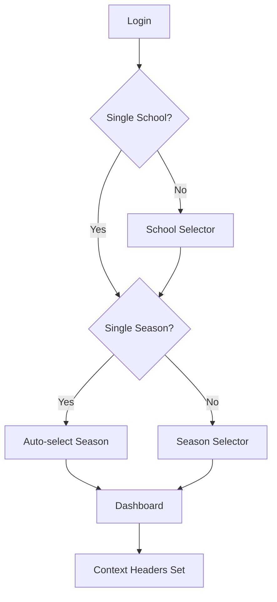

# Boukii V5 - Resumen Ejecutivo

## 🎯 Visión General del Proyecto

Boukii V5 es una **plataforma modular de gestión para escuelas deportivas** que implementa una arquitectura **multi-tenant** basada en escuelas y temporadas. El sistema está diseñado para ser escalable, mantenible y compatible con sistemas legacy existentes.

### 🏢 Multi-Tenancy
- **School-based isolation**: Cada escuela tiene sus propios datos
- **Season context**: Operaciones contextualizadas por temporada
- **Permission hierarchy**: Global → School → Season → Resource
- **Data segregation**: Aislamiento completo entre tenants

## 💻 Stack Tecnológico

### Frontend (Angular 16)
- **Core**: Angular 16 + TypeScript + RxJS
- **UI**: Vex Theme + TailwindCSS + Angular Material
- **Auth**: JWT + Context guards
- **State**: Services + RxJS (sin estado global complejo)

### Backend (Laravel 10+)
- **Core**: Laravel 10 + PHP 8.1+ + MySQL
- **Auth**: Laravel Sanctum + JWT + Context headers
- **Permissions**: Spatie Laravel Permission + Custom hierarchy
- **Cache**: Redis + Application cache
- **Queue**: Redis + Horizon

## 🎯 Módulos Principales

### Frontend (Angular 16)
- **🏠 Dashboard V5**: Widgets dinámicos, métricas en tiempo real
- **👥 Clients**: CRUD completo, gestión multi-escuela  
- **📚 Courses**: Gestión de cursos con contexto temporal
- **📅 Bookings**: Sistema de reservas avanzado con pricing
- **👨‍🏫 Monitors**: Gestión de instructores y asignaciones
- **📊 Analytics**: Reporting y análisis por escuela/temporada
- **⚙️ Administration**: Usuarios, roles, configuración

### Backend (Laravel 10+)
- **🔐 Authentication V5**: Multi-school login + context
- **🏫 Schools Management**: Multi-tenant admin
- **📅 Seasons Management**: Temporal contexts
- **🔒 Permissions**: 4-level hierarchy system
- **📊 Dashboard Stats**: KPIs y métricas
- **🛡️ Security**: Context validation + audit logs

## 🏗 Arquitectura de Alto Nivel

### Flujo de Autenticación Completo


1. **Login** → Validar credenciales + obtener schools
2. **School Selection** → Auto o manual según disponibles
3. **Season Selection** → Auto o manual según activas  
4. **Context Established** → Headers inyectados automáticamente
5. **Dashboard Access** → Con contexto completo

### Headers de Contexto (Críticos)
```yaml
Authorization: "Bearer {jwt_token}"
X-School-ID: "{school_id}"
X-Season-ID: "{season_id}"
Content-Type: "application/json"
```

### Middleware Stack (Backend)
```
Request → auth:sanctum → context.middleware → role.permission → Controller
```

## 📊 Estado Actual (Agosto 2025)

### ✅ Completado (85%)
- **Authentication**: Sistema multi-escuela funcional
- **Context Middleware**: Validación headers + permissions
- **Core APIs**: Endpoints principales implementados
- **Database**: Migraciones + seeds + test data
- **Frontend Guards**: Auth + context validation
- **Testing**: Suite básica de tests

### 🔄 En Desarrollo (10%)
- **Dashboard Widgets**: Métricas avanzadas
- **CRUD Modules**: Completar clients, courses, bookings
- **Advanced Permissions**: Resource-level granularity
- **Performance**: Optimizaciones + cache

### ⏳ Pendiente (5%)
- **E2E Testing**: Suite completa
- **Documentation**: OpenAPI specs
- **Deployment**: CI/CD pipeline
- **Monitoring**: Logs + metrics

## 🌟 Innovaciones V5

### Arquitectura
- **Single Context**: Un solo middleware para todo el contexto
- **Permission Inheritance**: Jerarquía de 4 niveles inteligente
- **Smart Guards**: Context-aware navigation guards
- **Type Safety**: Full TypeScript + Laravel typed responses

### User Experience  
- **Smart Defaults**: Auto-selección inteligente de school/season
- **Context Persistence**: LocalStorage + backend validation
- **Seamless Navigation**: Sin pérdida de contexto
- **Progressive Enhancement**: Funciona sin JS completo

### Developer Experience
- **Unified Documentation**: Sync bidireccional entre repos
- **Rich Tooling**: Scripts, seeders, test utilities
- **Clear Conventions**: Naming, structure, patterns
- **AI-Friendly**: Extensive Claude/AI integration guides

## 🔄 CI/CD y Workflows

### Commits y PRs
- Prefijos: `feat:`, `fix:`, `docs:`, `docs-sync:`
- PRs requieren review antes de merge
- Tests automáticos en pipeline

### Sincronización de Docs
- `/docs/shared/` se sincroniza automáticamente entre repos
- Anti-bucle: commits con `docs-sync:` no disparan nueva sync
- Script local disponible para sync manual

## 📂 Carpeta Shared

Esta carpeta contiene documentación que debe mantenerse sincronizada entre frontend y backend:

- **V5_OVERVIEW.md**: Este archivo
- **OPENAPI_README.md**: Especificaciones de API
- **PROMPTS_GUIDE.md**: Guías para IA/Claude
- **TESTING_GUIDE.md**: Comandos y estrategias de testing
- **WORKING_AGREEMENTS.md**: Convenciones del equipo

## 🚀 Quick Start

### Frontend
```bash
npm install
npm start  # Desarrollo con live reload
npm run build:development
```

### Backend
```bash
composer install
php artisan migrate
php artisan db:seed --class=V5TestDataSeeder
```

### Acceso Local
- Frontend: http://localhost:4200
- Backend: http://api-boukii.test

## 📋 Estado Actual V5

✅ **Completado**
- Sistema de autenticación multi-escuela
- Context middleware unificado
- Guards y interceptors
- Seeds y datos de prueba

🔄 **En Desarrollo** 
- Dashboard widgets dinámicos
- Módulos CRUD completos
- Tests E2E comprehensive

⏳ **Pendiente**
- Performance optimización
- Documentación OpenAPI completa
- Deploy automatizado

---
*Última actualización: 2025-08-13*